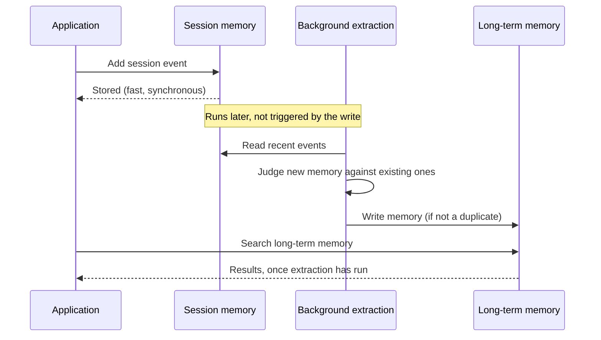

## Background summarization and extraction

Session storage you've built in Redis before likely only holds what the application writes to it. Agent Memory adds a second writer: once you enable summarization and extraction, the service itself reads session events in the background and does two things without an application write:

- **Summarizes** older events into a compact summary once the session passes a configured threshold, so a long conversation doesn't blow the model's context window.
- **Extracts long-term memories**, facts and preferences worth keeping, and writes them as separate, searchable records with vector embeddings.

Both run asynchronously, to keep session writes fast. Extraction also weighs a new memory against existing ones before writing it: rather than rejecting anything that looks similar, it uses model judgment to decide whether a near-identical memory is a true duplicate or is meaningfully different and worth keeping too.

If you search long-term memory immediately after a session event, the memory extracted from that event might not exist yet. Extraction lag is the most common cause when code writes a session event, immediately searches long-term memory, and finds nothing: extraction hasn't run yet.

## Memory types

You can think of Redis Agent Memory's tiers as analogous to human memory:

| Human memory | What it holds | Redis Agent Memory tier |
|:---|:---|:---|
| Working memory | What's being discussed right now | Session memory: the ordered events of the current conversation |
| Episodic memory | What happened in a specific past experience | Long-term memory, `episodic` type: a snapshot from one session |
| Semantic memory | Facts and preferences you've generalized over time | Long-term memory, `semantic` type: durable, cross-session facts |

Session memory is the working set: the current conversation's events, read and written every turn. Long-term memory is what survives after the session ends, durable enough to recall in a conversation the agent hasn't seen before.

This table is a simplified starting point, not the full picture. Redis Agent Memory also maintains an automatically updated summary of each session as its own long-term memory type, and you can define custom types for domain-specific information. See [Memory types & extraction](/content/operate/iris/agent-memory/create-service.md#memory-types-and-extraction) for the complete set of built-in and custom types.

## FAQ

**Does Agent Memory replace my session store?**
Only if your session store's job was holding conversation state. Session memory in Redis Agent Memory is that store, with automatic TTL-based expiration and no schema to design. Session memory doesn't replace a general-purpose cache or your application's other session data unrelated to the conversation.

**What happens if I write directly to long-term memory instead of letting extraction do it?**
Both paths are supported. Use direct writes for bulk imports or external knowledge sources: anything that didn't originate in a conversation. Automatic extraction is for facts that emerge from session events themselves.

**Why didn't a memory I expected to be created show up?**
Automatic extraction considers the conversation and existing memories when deciding what to create. If a new memory looks like it may be a duplicate, it isn't stored, even if the wording differs from the existing memory, since the check is based on meaning, not exact text. If your application needs to guarantee a memory exists, create it directly instead of relying on extraction.

## Further reading

- [Semantic memory search for AI agents](https://redis.io/blog/semantic-memory-search-ai-agents/): how semantic recall handles the freshness/staleness problem that keyword search doesn't.
- [Long-horizon AI agents: memory & state infrastructure](https://redis.io/blog/long-horizon-ai-agents-memory-state-infrastructure/): failure modes (context rot, memory drift, goal-coherence loss) that show up once an agent runs longer than a single session.
- [Agent memory as a moat: how context compounds](https://redis.io/blog/compounding-context-memory-as-the-moat/): scoping, retention, and access-control tradeoffs as memory accumulates.
- [Build AI agents with short-term & long-term memory in Redis](https://redis.io/blog/build-smarter-ai-agents-manage-short-term-and-long-term-memory-with-redis/): a broader architectural-decision framework if you're weighing memory tiers, retention, and decay for your own agent.

See the [AI agent context engine FAQ](https://redis.io/blog/faq-real-time-context-engine-agent-memory-and-retrieval/) for build-vs-buy and vendor-comparison questions this page doesn't cover.

## Next steps

- [Developer guide](/content/develop/ai/context-engine/agent-memory/developer-guide.md) to connect an application and start writing session events.
- [Python SDK quickstart](/content/develop/ai/context-engine/agent-memory/python-sdk-quickstart.md), [TypeScript SDK quickstart](/content/develop/ai/context-engine/agent-memory/typescript-sdk-quickstart.md), or [REST API quickstart](/content/develop/ai/context-engine/agent-memory/rest-api-quickstart.md) to see session memory, extraction, and summarization in action.
