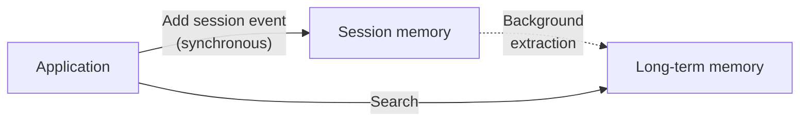

## Background summarization and extraction

Agent Memory has two writers. Your application writes session events as they happen. After you enable summarization and extraction, Agent Memory reads those events in the background and does two things without an application write:

- **Summarizes** older events into a compact summary once the session passes a configured threshold, so a long conversation doesn't blow the model's context window.
- **Extracts** long-term memories, facts and preferences worth keeping, and writes them as separate, searchable records with vector embeddings.

Both run asynchronously, to keep session writes fast. Extraction also weighs a new memory against existing memories before writing it. Rather than rejecting anything that looks similar, it uses model judgment to decide whether a near-identical memory is a true duplicate or is meaningfully different and worth keeping too.

## Memory types

You can think of Redis Agent Memory's tiers as analogous to human memory:

| Human memory | What it holds | Redis Agent Memory tier |
|:---|:---|:---|
| Working memory | What's being discussed right now | Session memory: the ordered events of the current conversation |
| Episodic memory | What happened in a specific past experience | Long-term memory, `episodic` type: a snapshot from one session |
| Semantic memory | Facts and preferences you've generalized over time | Long-term memory, `semantic` type: durable, cross-session facts |

Session memory is the working set: the current conversation's events, read and written every turn. Long-term memory is what survives after the session ends, durable enough to recall in a conversation the agent hasn't seen before.

This table is a simplified starting point, not the full picture. Redis Agent Memory also maintains an automatically updated summary of each session, as derived session state. It returns this summary separately from long-term memories. You can also define custom long-term memory types for domain-specific information. See [Memory types & extraction]() for the complete set of built-in and custom types.

## Adding to session memory

Your application gives Agent Memory the conversation for extracting long-term memories by appending to session memory. Think of session memory as a shared transcript that both your application and the background extraction pipeline read.

### Key terms

- **Session event**: One message in a conversation, added with `sessionId`, `actorId`, `role`, `content`, and `createdAt`.
- **actorId**: Identifies who or what sent the event, a user, the agent, or a tool.
- **ownerId**: Identifies who a long-term memory belongs to, for search and filtering later. Independent of who wrote the session event it came from.
- **memoryType**: The long-term memory tier a fact is stored under, one of the built-in types (`semantic`, `episodic`, `message`, `session_summary_view`) or a custom type you define.

### How it works

1. **Add the event.** Your application sends the new turn to session memory as it happens. This write is synchronous and fast.
2. **Extraction reads the session.** In the background, extraction reads the session's accumulated events, not just the latest one, so it can resolve context across turns.
3. **Long-term memory is written.** Facts worth keeping are stored as separate, searchable records, scoped by owner and memory type.

Extraction reads the whole session. You only need to send each new turn as it happens. You don't need to resend earlier turns for a later one to be understood in context.

## FAQ

**Do I still need a separate store for conversation state?**
No, not for that purpose. Session memory holds the ordered events of a conversation, with automatic expiration based on a time-to-live (TTL) you set, and no schema to design. It doesn't replace a general-purpose cache or your application's other session data unrelated to the conversation.

**What happens if I write directly to long-term memory instead of letting extraction do it?**
Both paths are supported. Use direct writes for bulk imports or external knowledge sources: anything that didn't originate in a conversation. Automatic extraction is for facts that emerge from session events themselves.

## Next steps

- [Developer guide]() to connect an application and start writing session events.
- [Python SDK quickstart](), [TypeScript SDK quickstart](), or [REST API quickstart]() to see session memory, extraction, and summarization in action.
