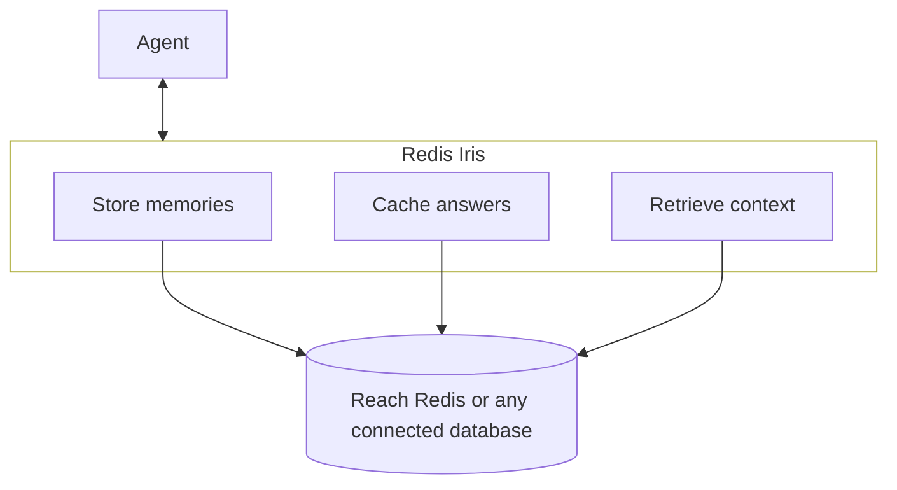

Redis Iris sits between your agent and your data. It's one system. Your agent asks for context. Iris returns it through the fastest available path: a cached answer, a remembered fact, or a live lookup against your business data. That data can live in Redis or in another database you connect. You don't wire together separate lookups yourself. Iris decides which path answers the request.

Use Redis Iris when you want agents to respond with cached answers instead of repeat model calls, recall what they've learned across turns and sessions, and act on live business data. Iris builds and maintains that infrastructure for you.

## The mental model

| Without a context layer | With Redis Iris |
|:---|:---|
| Replay the full conversation history every turn | Recall only what's relevant, summarized or extracted once |
| Call the model even when you already know the answer | Return a cached answer when a similar request already ran |
| Give the agent a live database connection or let it generate its own queries | Give it a fixed set of governed tools that fetch exactly what's needed |
| Build separate integration code for every data source | Reach Redis or any connected database through the same interface |

## What happens on a request

Iris does up to three things before your agent's request reaches the model, in whatever combination the request needs:

1. **Recall.** Iris checks whether it already has a cached answer for a similar request, or relevant memory from earlier in the conversation or a past session. If so, it returns that instead of spending a model call.
2. **Retrieve.** If the request depends on current business data, Iris fetches exactly what's needed through a governed tool call, not a raw database query the agent constructs itself.
3. **Record.** After the model responds, Iris writes back what's worth remembering. The next request, in this conversation or a future one, can recall it.

Not every request needs all three. A question the cache already answered skips straight to a response. A question about live inventory or account data skips the cache and goes straight to retrieval.

## Two phases: serving and recording

Most requests touch Redis Iris at two points:

1. **Before the model call**, check whether Iris already has what's needed: a cached answer, relevant memory, or business data a tool can fetch.
2. **After the model responds**, let Iris record what's worth keeping. The next request doesn't start from nothing.

### 1. Serving the request (reading)

Iris draws on whichever of its capabilities the request needs, before the model call:

- **Cache check.** Iris compares the incoming prompt against previously cached responses. A close-enough match returns immediately, skipping the model call.
- **Memory recall.** Iris searches session and long-term memory for what's relevant to this conversation or user. You don't need to replay the full transcript to the model.
- **Governed retrieval.** If the request depends on current business data, Iris calls a fixed tool generated from your data model instead of running a raw query.

### 2. Recording the interaction (writing)

Iris writes back what's worth keeping after the model responds. Your application doesn't do this explicitly:

- **Session write.** Iris stores the conversation's events as they happen. The next turn has recent history available.
- **Background extraction.** Iris pulls durable facts and preferences out of the conversation and stores them separately, with embeddings for later semantic search.
- **Cache write.** Iris stores the new prompt-and-response pair as a candidate to serve the next similar request without a model call.

This write path runs asynchronously. It doesn't slow down the response your application is waiting for.

## Where context lives

Redis Iris splits that context across stores, each built for a different lookup pattern:

| Store | Holds | Purpose |
|:---|:---|:---|
| Cache index | Prompt embeddings and their cached responses | Sub-second similarity lookups before a model call |
| Memory store | Session events and extracted long-term facts, with embeddings | Recall across turns and sessions |
| Your business data | Whatever you already store in Redis or a connected database | Queried through governed tools, not a raw connection |

Run all three fully managed on Redis Cloud, or self-managed on your own infrastructure. Either way, you configure what to keep and for how long, not how the underlying store works.

## Build against this flow

- Let Iris decide what's cached and what's fresh. Don't build a separate caching layer on top of the model call.
- Write session events as they happen. Let background extraction decide what's durable, rather than deciding yourself on every turn.
- Model your business data as entities and relationships once. Let Context Retriever generate the tools your agent calls, instead of writing a tool per query.
- Scope every write and lookup by user, session, or namespace. This keeps agents and users from colliding.

## Next steps

- [How a request flows through Redis Iris]()
- [LangCache concepts]()
- [Agent Memory overview]()
- [Context Retriever concepts]()
