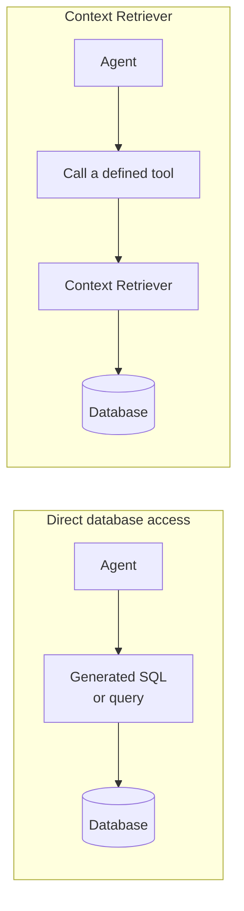

## A layer on top of your database, not a replacement for it

Context Retriever gives an agent a fixed, predefined set of callable tools to use instead of **direct query access**: the model you'd otherwise reach for is giving the agent a database connection, or generating SQL for it to run. Your database, its schema, and its own access controls are unchanged; Context Retriever sits between the agent and that database as an added layer.

## Direct data access vs. governed tool-calling

If you've built backend services before, you're used to reasoning about data access as a permissions problem: which role can query which tables. Context Retriever reframes it as an API-design problem: which tools exist, and what does each one return.

| | Direct database access | Context Retriever |
|:---|:---|:---|
| What the agent gets | A query interface (SQL, an ORM, a generic API) | A fixed set of tools generated from your data model |
| How you scope access | Row/column permissions, roles | Access tags on the agent's key, filtering which tools and data it can reach |
| What a bad request looks like | A malformed or overly broad query | A call to a tool that isn't defined; Context Retriever doesn't guess a path around it |
| Where you invest | Query optimization, permission grants | Modeling entities and relationships once, reused by every agent |

## Why agents don't get raw query access

An agent's input often includes content it didn't choose to trust. An agent that summarizes a document, reads a support ticket, or follows a web page can have its next action influenced by text embedded in that content (prompt injection). If that agent also holds a database connection or can generate arbitrary SQL, injected content can turn into an arbitrary query. A fixed tool surface bounds the blast radius: the worst an agent can do is call a tool it was already allowed to call, with parameters that tool already accepts.

## FAQ

**Why can't my agent run SQL directly?**
Because "run SQL" means the set of things an agent can do is as large as your schema, and an agent's next action can be influenced by untrusted content it's processing. A fixed tool surface (call this tool with these parameters) bounds that risk to what the tool itself allows.

**How is Context Retriever different from a regular REST API?**
Context Retriever uses the same idea (a fixed, callable surface instead of a query language), but the tools are generated from your entity model instead of hand-written per endpoint, and access is scoped per agent key via tags rather than a single API-wide permission model.

**What happens when an agent needs a query I haven't defined a tool for?**
The agent can't get that data — Context Retriever doesn't fall back to an open query path by design. Extend your entity model and regenerate the tool set instead.

See the [AI agent context engine FAQ](https://redis.io/blog/faq-real-time-context-engine-agent-memory-and-retrieval/) for how this compares to text-to-SQL and OpenAPI-to-MCP approaches.

## Next steps

- [Create a Context Retriever service]() on Redis Cloud.
- Model your entities with the [Python client and `ctxctl` CLI](https://pypi.org/project/redis-context-retriever/).
- [Manage agent keys and access tags]() to control what each agent can reach.
