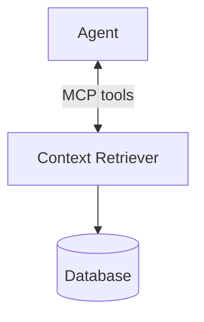

## A layer on top of your database, not a replacement for it

Context Retriever gives an agent a fixed, predefined set of callable tools to use instead of direct query access. Your database, its schema, and its own access controls stay unchanged. Context Retriever sits between the agent and that database, as an added layer.

## Direct data access vs. governed tool-calling

If you've built backend services before, you're used to reasoning about data access as a permissions problem: which role can query which tables. Context Retriever reframes it as an API-design problem: which tools exist, and what does each one return.

| | Direct database access | Context Retriever |
|:---|:---|:---|
| What the agent gets | A query interface (SQL, an ORM, a generic API) | A fixed set of tools generated from your data model |
| How you scope access | Row/column permissions, roles | Access tags on the agent's key, filtering which tools and data it can reach |
| What a bad request looks like | A malformed or overly broad query | A call to a tool that isn't defined; Context Retriever doesn't guess a path around it |
| Where you invest | Query optimization, permission grants | Modeling entities and relationships once, reused by every agent |

## Why agents can't access raw queries

An agent's input often includes content it didn't choose to trust. An agent that summarizes a document, reads a support ticket, or follows a web page can act on text embedded in that content (prompt injection). If that agent also holds a database connection, or can generate arbitrary SQL, injected content can turn into an arbitrary query. A fixed tool surface bounds the blast radius. Context Retriever ensures that the worst an agent can do is call a tool it was already allowed to call, with parameters that tool already accepts.

## Key terms

- **Entity**: A business object in your data. You define it with a key template, such as `customer:{id}`, and a set of fields.
- **Field**: An attribute of an entity. One field is the primary key. Others can be indexed for search and filtering, or linked to another entity as a relationship.
- **Index type**: How a field can be searched. Options are text, tag (exact match), numeric, and vector (semantic similarity).
- **Tool**: A callable operation generated from your entity model, such as a search or get-by-ID lookup for an entity.
- **Agent key**: Scopes which tools and data an agent can reach, through access tags.

## How it works

1. **Model your entities.** Define your entities, their key templates, fields, primary keys, and relationships. Use the Redis Cloud console, a model file, or the Python client.
2. **Context Retriever generates tools.** It creates a fixed set of tools from your model, such as a search and a get-by-ID tool for each entity. These tools are exposed over MCP.
3. **An agent calls a tool.** The agent uses an agent key scoped by access tags. It calls a generated tool instead of running a query, and gets back structured data.

Changing your entity model regenerates the tool set. Add a field or relationship, and the tools available to your agents change with it.

## Modeling is an upfront investment, but it's reusable

Modeling your entities takes more upfront work than giving an agent a database connection. You define your objects, their key templates, and their relationships once. You don't rely on the agent to work them out from a raw query.

That upfront work pays off. Every agent that uses the surface reuses the same tools, instead of rebuilding them per agent or per query.

You can define fields manually, or let Context Retriever auto-detect them by scanning a sample of your existing keys. Auto-detection is faster, but it's a starting point, not a guarantee. The model that infers fields and relationships can get them wrong. Review what it generates before you rely on it. Manual modeling takes longer, but it gives you exact control over which tools get generated and what an agent can reach.

## FAQ

**Why can't my agent run SQL directly?**
"Run SQL" means the set of things an agent can do is as large as your schema. Untrusted content the agent is processing can also influence its next action. A fixed tool surface, call this tool with these parameters, bounds that risk to what the tool itself allows.

**How is Context Retriever different from a regular REST API?**
Context Retriever uses the same idea: a fixed, callable surface instead of a query language. The tools are generated from your entity model, instead of hand-written per endpoint. Access is scoped per agent key through tags, rather than a single API-wide permission model.

**What happens when an agent needs a query I haven't defined a tool for?**
The agent can't get that data. Context Retriever doesn't fall back to an open query path by design. Extend your entity model and regenerate the tool set instead.

See the [AI agent context engine FAQ](https://redis.io/blog/faq-real-time-context-engine-agent-memory-and-retrieval/) for how this compares to text-to-SQL and OpenAPI-to-MCP approaches.

## Next steps

- [Create a Context Retriever service]() on Redis Cloud.
- [Install Context Retriever]() on your own Kubernetes infrastructure.
- Follow the [quickstart]() to model entities, generate tools, and call one with the `ctxctl` CLI.
- [Manage agent keys and access tags]() to control what each agent can reach.
