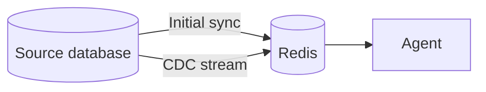

Stream live business data into Redis so agents always work with accurate, up-to-date information.

Redis Data Integration (RDI) keeps your Redis Cloud database in sync with your existing relational databases using [Change data capture](https://en.wikipedia.org/wiki/Change_data_capture) (CDC). Agents query Redis at full speed without ever querying your production databases directly.

  
  
  

## What is Redis Data Integration?

Redis Data Integration (RDI) is a pipeline service, available fully managed on Redis Cloud or self-managed on your own infrastructure, that:

- **Syncs data in near real time**: Changes in your source database propagate to Redis within seconds using CDC
- **Keeps agents away from source databases**: Agents query Redis at full speed, preserving performance and security
- **Requires no coding**: Define pipelines through configuration; transformations are handled automatically
- **Handles initial and streaming sync**: Full snapshot on first run, then continuous change capture from that point on
- **Supports major relational databases**: Oracle, MySQL, PostgreSQL, MariaDB, SQL Server, and AWS Aurora

## Why use Redis Data Integration?

  

    <h3 class="text-redis-ink-900 font-semibold mb-3">For AI applications</h3>
    <ul class="space-y-1 text-redis-pen-600">
      <li>Eliminate stale data: agents always see current business state</li>
      <li>Millisecond query performance from Redis instead of slow source DB calls</li>
      <li>No cache invalidation logic to write or maintain</li>
      <li>Combine with Context Retriever for governed, always-fresh agent tools</li>
    </ul>
  

  

    <h3 class="text-redis-ink-900 font-semibold mb-3">For developers</h3>
    <ul class="space-y-1 text-redis-pen-600">
      <li>Configuration-driven: no custom ETL code required</li>
      <li>Deploy fully managed on Redis Cloud or self-managed on your own infrastructure</li>
      <li>~10,000 records per second per core for initial snapshots and streaming</li>
      <li>At-least-once delivery guaranteed for every change in the defined dataset</li>
    </ul>
  

## Quick example

RDI pipelines are defined through configuration. You specify which source database tables to sync, how to map each row to a Redis key, and what transformations to apply. No custom code is required.

See the [RDI quick start](/content/operate/rc/rdi/quick-start.md) for a step-by-step walkthrough syncing a live PostgreSQL source to Redis Cloud.

## Redis Data Integration overview

AI agents are only as reliable as the data they work with. RDI solves the freshness problem by using [Change Data Capture (CDC)](https://en.wikipedia.org/wiki/Change_data_capture) to detect changes in your source database and propagate them to Redis within seconds. Agents interact only with Redis, which is fast, predictable, and always current.

RDI pipelines run in two phases:

- **Initial sync**: Reads a full snapshot of your source data and loads it into the target Redis database.
- **Streaming**: Captures changes as they happen and applies them to Redis within seconds of the source change.

Data is transformed from relational rows into Redis hashes or JSON documents as part of the pipeline, with no coding required. You define what data to sync and how to map it using configuration, and RDI handles the rest.

### Why agents need fresh data

Without a reliable data pipeline, agents face two common failure modes: stale cached data that no longer reflects reality, or slow queries to source databases that block agent responsiveness. RDI eliminates both by maintaining a continuously updated Redis cache that agents can query at full Redis speed.

## Key benefits

- **Near real-time updates**: Changes in your source database reach Redis within seconds using CDC.
- **No direct database access**: Agents query Redis, not your production databases, preserving performance and security.
- **No coding required**: Define pipelines through configuration. Transformations are handled automatically.
- **Fully managed on Redis Cloud**: No infrastructure to provision or maintain.
- **High throughput**: Processes approximately 10,000 records per second per core for initial snapshots and streaming.
- **At-least-once delivery**: RDI guarantees every change in the defined dataset is delivered to Redis.

## Supported source databases

RDI supports the following source databases when used with Redis Cloud:

| Database | Versions |
|----------|----------|
| Oracle | 19c, 21c |
| MySQL | 5.7, 8.0.x, 8.2 |
| PostgreSQL | 10–16 |
| MariaDB | 10.5, 11.4.3 |
| AWS Aurora PostgreSQL | 15 |
| SQL Server | 2017, 2019, 2022 |

## Get started {#get-started}



RDI on Redis Cloud is available in preview for Redis Cloud Pro databases hosted on AWS.

To get started:

1. [Prepare your source database](/content/operate/rc/rdi/setup.md) and configure credentials and connectivity.
2. [Define your data pipeline](/content/operate/rc/rdi/define.md) by selecting which tables to sync and how to map them.
3. [View and manage your pipeline](/content/operate/rc/rdi/view-edit.md) once it's running.

See the [RDI Cloud quick start](/content/operate/rc/rdi/quick-start.md) to get up and running quickly with a PostgreSQL source database.

-tab-sep-

RDI is also available for self-managed Redis Enterprise deployments. See the [Redis Data Integration documentation](/content/integrate/redis-data-integration/_index.md) for full installation and configuration instructions.


