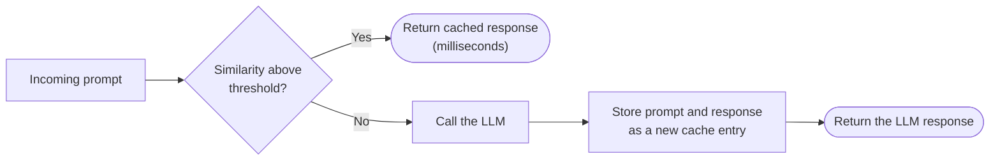

## Semantic caching

LangCache matches an incoming prompt against stored entries by similarity, not exact text, so two prompts that are close enough are treated as the same request. This similarity match lets *What are Product A's features?* and *Tell me about Product A's capabilities* share a cached response.

If you've used a traditional, exact-key cache before, similarity matching behaves differently from what you're used to. Semantic caching gives up the guarantee that a cache hit is always correct, in exchange for the ability to match paraphrased or related questions. That trade-off is what makes the cache useful for an agent. Users and agents rarely phrase the same request the same way twice. Matching by meaning, instead of exact text, turns repeat requests into fast, cache-served responses.

## Exact-key caching vs. semantic caching

Here's how the two compare:

| | Exact-key caching | Semantic caching (LangCache) |
|:---|:---|:---|
| Match criterion | Exact key equality | Similarity above a threshold |
| Hit/miss | Binary: no in-between | Threshold-tuned: a near-miss is still possible |
| Correctness risk | None from the cache itself | A false-positive match can return a wrong answer |
| Tuning | Time-to-live (TTL), eviction policy | TTL, eviction policy, **and** similarity threshold |

## Key terms

- **Cache ID**: The unique identifier for your LangCache service. You pass it as the `cacheId` path parameter in every API call.
- **Attributes**: Custom key-value tags you define per service, up to 5. Attach them to a cache entry to scope later searches and deletes.
- **Embedding provider**: The model that generates embeddings for similarity matching. Choose Redis, OpenAI, or your own provider.
- **Search strategy**: How LangCache matches a request against stored entries. `exact` matches on literal text. `semantic` matches by embedding similarity above your threshold.

## Choosing a threshold is a tradeoff, even with a default

LangCache defaults to a similarity threshold of `0.85`, with a recommended starting range of `0.8`–`0.9`. No single value is correct for every use case. A tighter threshold reduces wrong-answer risk. It also reduces the hit rate you're paying for the cache to get. A looser threshold raises the hit rate. It also raises the odds of a false-positive match. The right setting depends on the relative cost of a wrong answer versus an unnecessary LLM call. A support FAQ bot can tolerate a looser threshold than a bot answering account-specific financial questions.

## FAQ

**Could I get back a response for a different question than the one I asked?**
Yes. Matching on similarity rather than exact content is an inherent property of semantic caching, not a bug. LangCache matches by similarity. A prompt that's close enough to a cached one can match, even when the two aren't equivalent. Tightening the similarity threshold makes mismatches less likely. You can also inspect a matched entry to see how close the embeddings actually were.

**Is there a default similarity threshold I should use?**
Yes. LangCache defaults to `0.85`, with a recommended starting range of `0.8`–`0.9`. From there, the right threshold is a tradeoff specific to your use case (see above). Start with a conservative, tighter threshold. Loosen it gradually while monitoring hit rate and spot-checking matches. Don't start loose and try to catch bad matches after the fact.

**Does LangCache replace my existing cache layer?**
Only the part of it that caches LLM responses by similarity. LangCache doesn't replace general-purpose exact-key caching for anything else in your application.

See the [AI agent context engine FAQ](https://redis.io/blog/faq-real-time-context-engine-agent-memory-and-retrieval/) for how LangCache compares to building your own cache or skipping caching for smaller workloads.

## Next steps

- [Create a LangCache service]() on Redis Cloud.
- [Deploy LangCache self-managed]() on your own Kubernetes infrastructure.
- [Use the LangCache API and SDK]() to search and populate a cache.
- [LangCache REST API reference]() for the full endpoint and parameter details, including threshold configuration.
