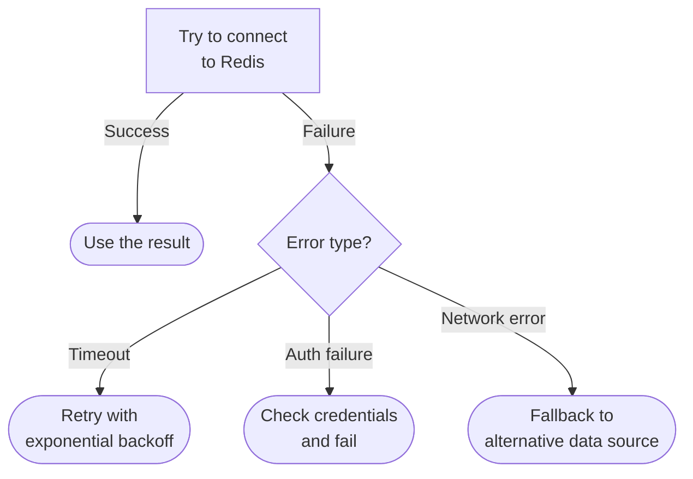
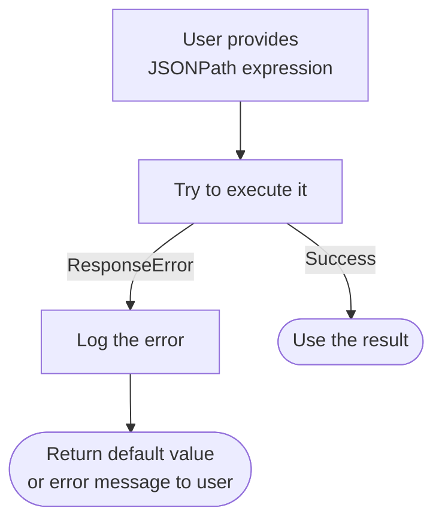
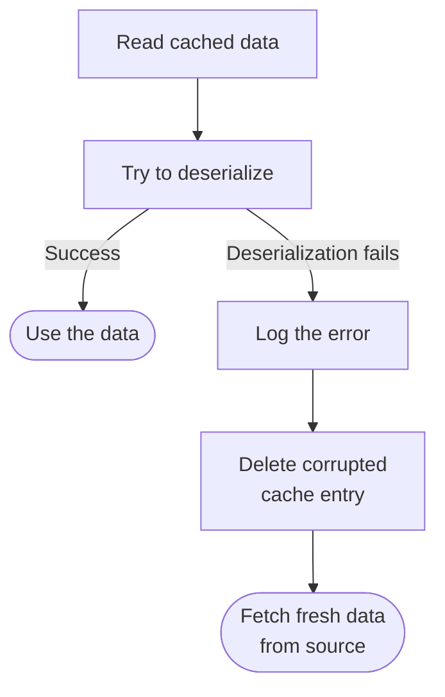
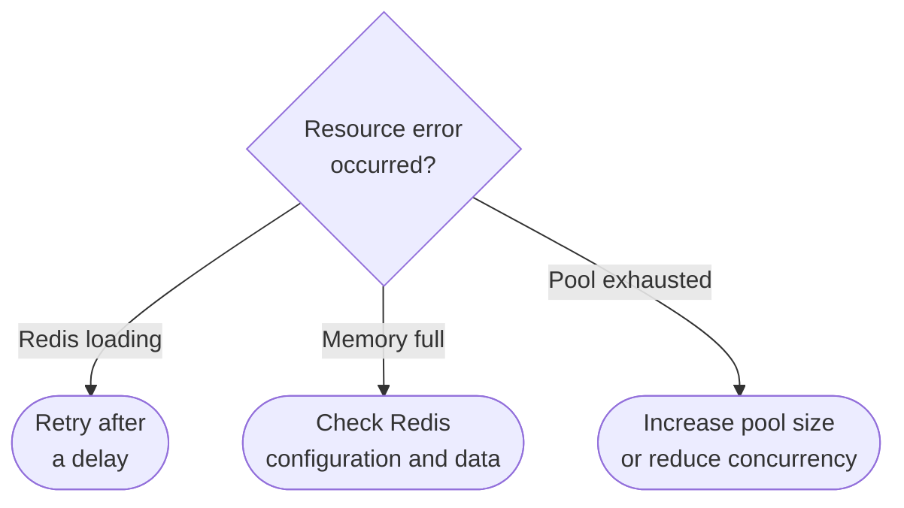
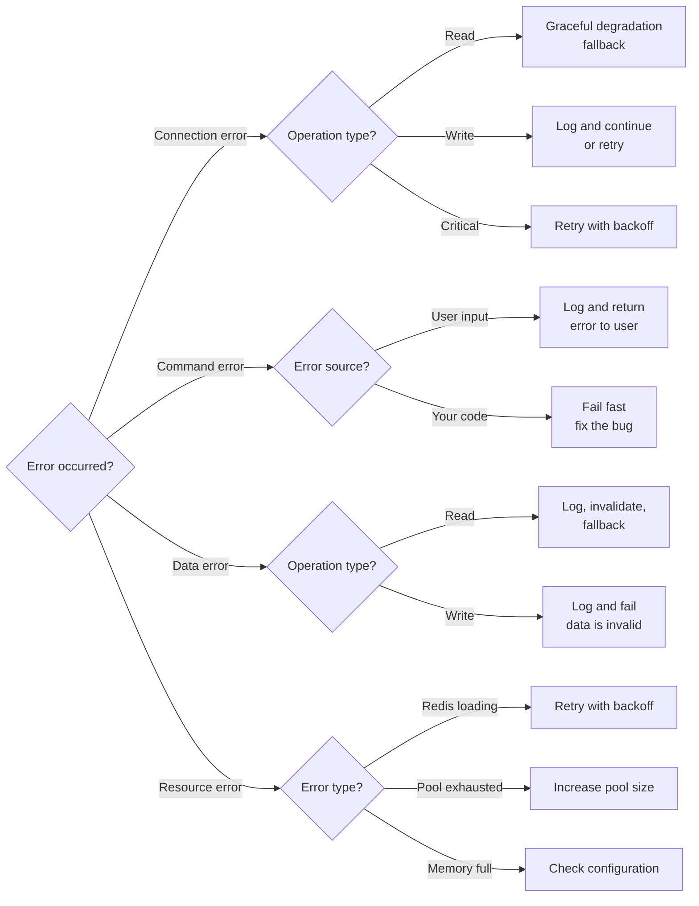

When working with Redis, errors can occur for various reasons, including network issues, invalid commands, or resource constraints. This guide explains the types of errors you might encounter and how to handle them effectively.

## Categories of errors

Redis errors fall into four main categories. The table below provides a quick overview of each type. Click on any error type to jump to its detailed section, which includes common causes, examples, handling strategies, and code examples.

| Error Type | Common Causes | When to Handle | Examples |
|---|---|---|---|
| [Connection errors](#connection-errors) | Network issues, server down, auth failure, timeouts, pool exhaustion | Almost always | `ConnectionError`, `TimeoutError`, `AuthenticationError` |
| [Command errors](#command-errors) | Typo in command, wrong arguments, invalid types, unsupported command | Rarely (usually indicates a bug) | `ResponseError`, `WRONGTYPE`, `ERR unknown command` |
| [Data errors](#data-errors) | Serialization failures, corrupted data, type mismatches | Sometimes (depends on data source) | `JSONDecodeError`, `SerializationError`, `WRONGTYPE` |
| [Resource errors](#resource-errors) | Memory limit, pool exhausted, too many connections, key eviction | Sometimes (some are temporary) | `OOM`, pool timeout, `LOADING` |

### Connection errors

Connection errors occur when your application cannot communicate with Redis. These are typically temporary and often recoverable.

**Common causes:**
- Network connectivity issues
- Redis server is down or unreachable
- Authentication failure
- Connection timeout
- Connection pool exhaustion

**Examples:**
- `ConnectionError`: Network failure or server unreachable
- `TimeoutError`: Operation exceeded the configured timeout
- `AuthenticationError`: Invalid credentials

**When to handle:** Almost always. Connection errors are usually temporary, so implementing retry logic or fallback strategies is recommended.

**Example strategy:**



### Command errors

Command errors occur when Redis receives an invalid or malformed command. These typically indicate a bug in your code.

**Common causes:**
-   Typo in command name
-   Wrong number of arguments
-   Invalid argument types (for example, supplying a
    [string]() key to a
    [list]() command))
-   Using a command that doesn't exist in your Redis version

**Examples:**
- `ResponseError`: Invalid command or syntax error
- `WRONGTYPE Operation against a key holding the wrong kind of value`
- `ERR unknown command`

**When to handle:** Rarely. These usually indicate programming error and so you
should fix the errors in your code rather than attempt to handle them at runtime. However, some cases (like invalid user input) may be worth handling.

**Example:**



### Data errors

Data errors occur when there are problems with the data itself, such as
serialization failures, or data corruption.

**Common causes:**
- Object cannot be serialized to JSON
- Cached data is corrupted
- Attempting to deserialize invalid data

**Examples:**
- `JSONDecodeError`: Cannot deserialize JSON data
- `SerializationError`: Cannot serialize object

**When to handle:** Sometimes. If the error is due to user input or external data, handle it gracefully. If it's due to your code, fix the code.

**Example:**



### Resource errors

Resource errors occur when Redis runs out of resources or hits limits.

**Common causes:**
- Memory limit reached
- Connection pool exhausted
- Too many connections
- Key eviction due to memory pressure

**Examples:**
- `OOM command not allowed when used memory > 'maxmemory'`
- Connection pool timeout
- `LOADING Redis is loading the dataset in memory`

**When to handle:** Sometimes. Some resource errors are temporary (Redis loading), while others indicate a configuration problem.

**Example:**



## Error handling patterns

### Pattern 1: Fail fast

Use this when the error is unrecoverable or indicates a bug in your code.

**When to use:**

- Command errors (invalid syntax)
- Authentication errors
- Programming errors

**Example:**

```python
try:
    result = r.get(key)
except redis.ResponseError as e:
    # This indicates a bug in our code
    raise  # Re-raise the exception
```

### Pattern 2: Graceful degradation

Use this when you have an alternative way to get the data you need, so you can
fall back to using the alternative instead of the preferred code.

**When to use:**

- Cache reads (fallback to database)
- Session reads (fallback to default values)
- Optional data (skip if unavailable)

**Example:**

```python
try:
    cached_value = r.get(key)
    if cached_value:
        return cached_value
except redis.ConnectionError:
    logger.warning("Cache unavailable, using database")

# Fallback to database
return database.get(key)
```

### Pattern 3: Retry with backoff

Use this when the error could be due to network load or other temporary
conditions.

**When to use:**

- Connection timeouts
- Temporary network issues
- Redis loading data

**Example:**

```python
import time

max_retries = 3
retry_delay = 0.1

for attempt in range(max_retries):
    try:
        return r.get(key)
    except redis.TimeoutError:
        if attempt < max_retries - 1:
            time.sleep(retry_delay)
            retry_delay *= 2  # Exponential backoff
        else:
            raise
```

Note that client libraries often implement retry logic for you, so
you may just need to provide the right configuration rather than
implementing retries yourself. See [Client-specific error handling](#client-specific-error-handling) below for links to pages that
describe retry configuration for each client library.

### Pattern 4: Log and continue

Use this when the operation is not critical to your application.

**When to use:**

- Cache writes (data loss is acceptable)
- Non-critical updates
- Metrics collection

**Example:**

```python
try:
    r.setex(key, 3600, value)
except redis.ConnectionError:
    logger.warning(f"Failed to cache {key}, continuing without cache")
    # Application continues normally
```

## Decision tree: How to handle errors



## Logging and monitoring

In production, you may find it useful to log errors when they
occur and monitor the logs for patterns. This can help you identify
which errors are most common and whether your retry and fallback
strategies are effective.

### What to log

- **Error type and message:** What went wrong?
- **Context:** Which key? Which operation?
- **Timestamp:** When did it happen?
- **Retry information:** Is this a retry? How many attempts?

**Example:**
```python
logger.error(
    "Redis operation failed",
    extra={
        "error_type": type(e).__name__,
        "operation": "get",
        "key": key,
        "attempt": attempt,
        "timestamp": datetime.now().isoformat(),
    }
)
```

### What to monitor

- **Error rate:** How many errors per minute?
- **Error types:** Which errors are most common?
- **Recovery success:** How many retries succeed?
- **Fallback usage:** How often do we use fallback strategies?

These metrics help you identify patterns and potential issues.

## Common mistakes

### Catching all exceptions

**Problem:** If you catch all exceptions, you might catch unexpected
errors and hide bugs.

**Example (wrong):**

```python
try:
    result = r.get(key)
except Exception:  # Too broad - some errors indicate code problems.
    pass
```

**Better approach:** Catch specific exception types.

**Example (correct):**

```python
try:
    result = r.get(key)
except redis.ConnectionError:
    # Handle connection error
    pass
```

### Not distinguishing error types

**Problem:** Different errors need different handling. For example, retrying a syntax error won't help.

**Example (wrong):**

```python
try:
    result = r.get(key)
except redis.ResponseError:
    # Retry? This won't help if it's a syntax error.
    retry()
```

**Better approach:** Handle each error type differently based on whether or not
it is recoverable.

**Example (correct):**

```python
try:
    result = r.get(key)
except redis.TimeoutError:
    retry()  # Retry on timeout
except redis.ResponseError:
    raise   # Fail on syntax error
```

### Ignoring connection pool errors

**Problem:** Connection pool errors indicate a configuration or concurrency issue that needs to be addressed.

**Example (wrong):**

```python
# Pool is exhausted, but we don't handle it
result = r.get(key)  # Might timeout waiting for connection
```

**Better approach:** Monitor pool usage and increase size if needed.

## Client-specific error handling

For detailed information about exceptions in your client library, see:

- [redis-py error handling]()
- [Node.js error handling]()
- [Java (Jedis) error handling]()
- [Go (go-redis) error handling]()
- [.NET (NRedisStack) error handling]()
