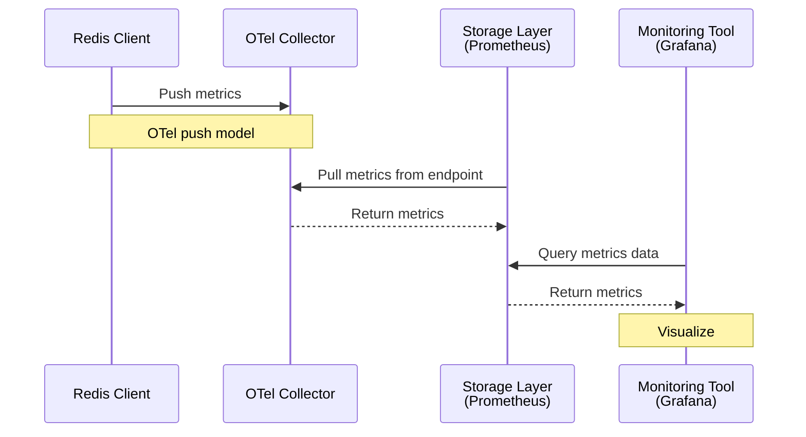

---
categories:
- docs
- develop
- stack
- oss
- rs
- rc
- oss
- kubernetes
- clients
description: Monitor your client's activity for optimization and debugging.
linkTitle: Observability
title: Observability
scope: overview
relatedPages:
- /develop/clients/redis-py/produsage
- /develop/clients/nodejs/produsage
- /develop/clients/go/produsage
topics:
- observability
- monitoring
- performance
- metrics
- logging
- tracing
weight: 60
---

Some Redis client libraries implement the [OpenTelemetry](https://opentelemetry.io/) (OTel)
observability framework to let you gather performance metrics
for your application. This can help you optimize performance and pinpoint problems
quickly. Currently, the following clients support OTel:

- [redis-py]()
- [go-redis]()

<!--
## Tracing overview

An execution trace is a record of the sequence of steps that the Redis
client takes as it executes commands. Each step or *span* (in OTel terminology)
represents a specific operation. In the trace, each span is recorded using an identifier
to represent the type of operation along with its start and finish time, its
completion or error status, and other relevant information.

For example, a simple trace might look like this:

```hierarchy
"Trace":
    "Span 1":
        _meta:
            description: "(Start time: 10000, End time: 10005, Status: OK)"
    "Span 2":
        _meta:
            description: "(Start time: 10005, End time: 10010, Status: OK)"
```

This contains two child spans, each representing a specific operation
such as executing a command or connecting to a Redis server.
Each span is recorded with its start time, end time, and status information.

A span can sometimes be broken down into sub-tasks (such as steps taken
while calling an external service), each of which is a span in its own right.
The full trace is therefore best understood as a tree of nested spans.

For example, a more complex trace might look like this:

```hierarchy
"Trace":
    "Span 1":
        _meta:
            description: "(Start time: 10000, End time: 10005, Status: OK)"
    "Span 2":
        "Span 2.1":
            _meta:
                description: "(Start time: 10005, End time: 10010, Status: OK)"
        "Span 2.2":
            _meta:
                description: "(Start time: 10010, End time: 10015, Status: OK)"
    "Span 3":
        "Span 3.1":
            _meta:
                description: "(Start time: 10015, End time: 10020, Status: OK)"
        "Span 3.2":
            _meta:
                description: "(Start time: 10020, End time: 10025, Status: OK)"
        "Span 3.3":
            _meta:
                description: "(Start time: 10025, End time: 10030, Status: OK)"
```

This trace shows how the second and third spans are themselves broken down into more
granular operations.

By examining the sequence of spans in a trace, you can determine where an error
(if any) occurred and how long each step took to execute. Since the information
in each trace is recorded, you can use monitoring tools such as
[Grafana](https://grafana.com/) to aggregate the data from many traces over time.
This can help you find operations that are slow on average compared to others
(suggesting a performance bottleneck that could be optimized) or that have a high
error rate (suggesting a deeper problem that could be fixed to improve reliability).
-->

## Metrics overview

Metrics are quantitative measurements of the behavior of your application. They
provide information such as how often a certain operation occurs, how long it
takes to complete, or how many errors have occurred. By analyzing these metrics,
you can identify performance bottlenecks, errors, and other issues that need to
be addressed.

Redis clients follow the OTel push model. This uses the
[OLTP](https://opentelemetry.io/docs/specs/otlp/) 
protocol to send metrics to a [collector](https://opentelemetry.io/docs/collector/)
(both [OLTP/gRPC](https://opentelemetry.io/docs/specs/otlp/#otlpgrpc) and
[OTLP/HTTP](https://opentelemetry.io/docs/specs/otlp/#otlphttp) are supported).
A storage layer (such as [Prometheus](https://prometheus.io/)) can then pull the
metrics from a collector endpoint, making the data available for monitoring tools
(such as [Grafana](https://grafana.com/)) to query and visualize. The basic
flow of data is shown below.



The [Redis client observability demonstration](https://github.com/redis-developer/redis-client-observability)
on GitHub contains examples showing how to set up a local Grafana instance, then
connect it to a Redis client and visualize the metric data as it arrives.

## Redis metric groups

In Redis clients, the metrics collected by OTel are organized into the following
metric groups:

- [`resiliency`](#group-resiliency): data related to the availability and health of the Redis connection.
- [`connection-basic`](#group-connection-basic): minimal metrics about Redis connections made by the client.
- [`connection-advanced`](#group-connection-advanced): more detailed metrics about Redis connections.
- [`command`](#group-command): metrics about Redis commands executed by the client.
- [`client-side-caching`](#group-client-side-caching): metrics about
  [client-side caching]() operations.
- [`streaming`](#group-streaming): metrics about
  [stream]() operations.
- [`pubsub`](#group-pubsub): metrics about
  [pub/sub]() operations.

When you configure the client to activate OTel, you can select which metric groups
you are interested in. By default, only the `resiliency` and `connection-basic` groups are enabled.
The metrics in each group are described in the
[Metrics reference](#metrics-reference) below.

## Metrics reference

The metric groups and the metrics they contain are described below. The
name in parentheses after each group name is the group's identifier, which you
use when you configure the client to select which metrics to collect.

The metrics contain *attributes* that provide extra information (such as
the client library and server details) that you can use to filter and
aggregate the data. The attributes are described in the Attributes
section following the metric groups. The badge shown after the attribute
name can be any of the following:

- `required`: This attribute will always be present in the metrics.
- `optional`: This attribute may be present in the metrics.
- `conditionally required`: This attribute will be present in the metrics only if a certain condition is met,
  such as when a specific error occurs. The condition is described in the attribute description.
- `recommended`: Specific client libraries may not support this attribute in some situations.


