

Redis Insight is a powerful tool for visualizing and optimizing data in Redis, making real-time application development easier and more fun than ever before. Redis Insight lets you do both GUI- and CLI-based interactions in a fully-featured desktop GUI client.

### Installation and release notes

| | | |
|---|---|---|
| [Installation guides]() See installation guides for all platforms | [Download Redis Insight](https://redis.io/downloads/#insight) Download Redis Insight directly from redis.io | [Release Notes]() View Redis Insight release notes and changelog |

## Overview

### Connection management

* Automatically discover and add your local Redis databases (that use standalone connection type and do not require authentication).
* Discover your databases in Redis Enterprise Cluster and databases with Flexible plans in Redis Cloud.
* Use a form to enter your connection details and add any Redis database running anywhere (including Redis Open Source cluster or sentinel).
* Connect to a Redis Data Integration (RDI) management plane, create, test, and deploy RDI pipelines, and view RDI statistics.


When you add a Redis database for a particular user using the `username` and `password` fields, that user must be able to run the `INFO` command. See the [access control list (ACL) documentation]() for more information.


### Redis Copilot

Redis Copilot is an AI-powered developer assistant that helps you learn about Redis, explore your Redis data, and build search queries in a conversational manner. It is available in Redis Insight as well as within the Redis public documentation.

Currently, Redis Copilot provides two primary features: a general chatbot and a context-aware data chatbot.

**General chatbot**: the knowledge-based chatbot serves as an interactive and dynamic documentation interface to simplify the learning process. You can ask specific questions about Redis commands, concepts, and products, and get responses on the fly. The general chatbot is also available in our public docs.

**My data chatbot**: the context-aware chatbot available in Redis Insight lets you construct search queries using everyday language rather than requiring specific programming syntax. This feature lets you query and explore data easily and interactively without extensive technical knowledge.

Here's an example of using Redis Copilot to search data using a simple, natural language prompt.

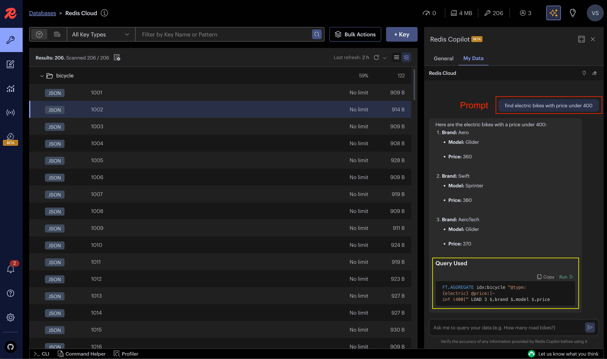

See the [Redis Insight Copilot FAQ]() for more information.

### RDI in Redis Insight

Redis Insight includes Redis Data Integration (RDI) connectivity, which allows you to connect to an RDI management plane, and create, test, and deploy RDI pipelines. Read more about this feature [here]().

### Browser

Browse, filter and visualize your key-value Redis data structures.
* [CRUD](https://en.wikipedia.org/wiki/Create,_read,_update_and_delete) support for lists, hashes, strings, sets, sorted sets, and streams
* CRUD support for [JSON]()
* Group keys according to their namespaces

  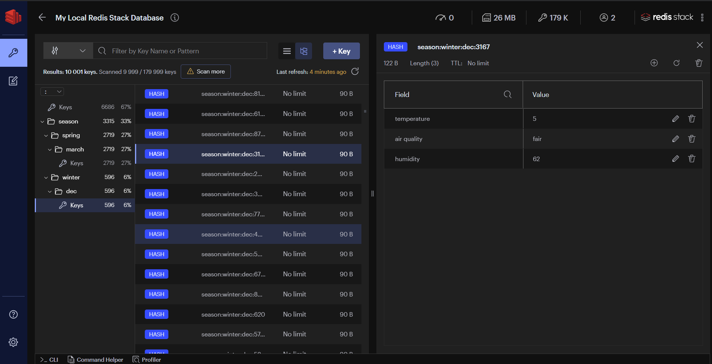

* View, validate, and manage your key values in a human-readable format using formatters that prettify and highlight data in different formats (for example, Unicode, JSON, MessagePack, HEX, and ASCII) in the Browser tool.

  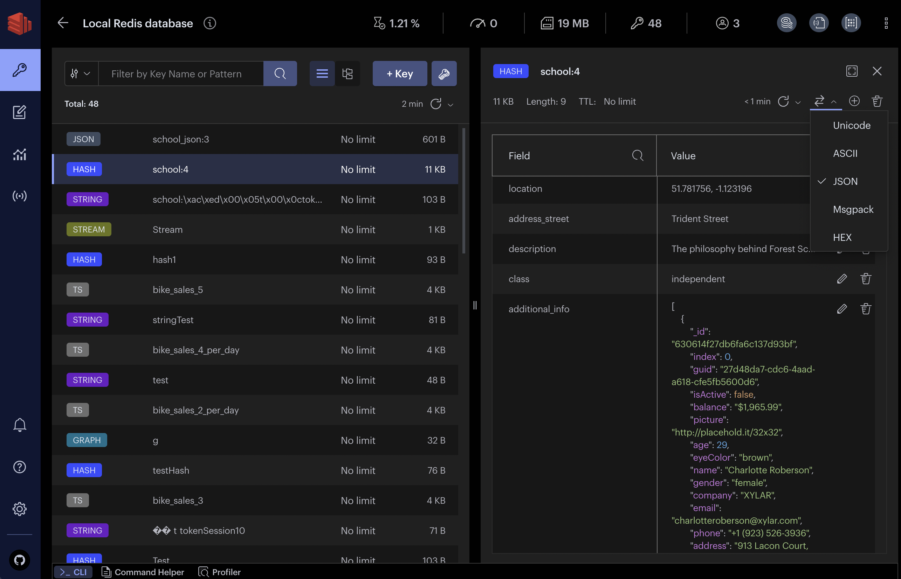

### Profiler

Analyze every command sent to Redis in real time.

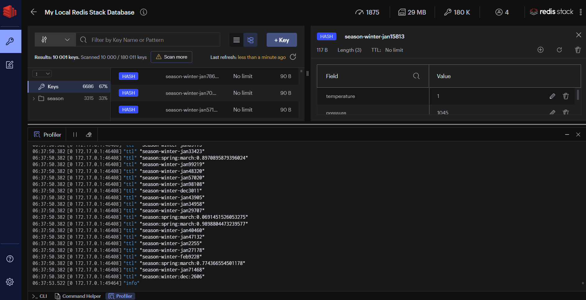

### CLI

The CLI is accessible at any time within the application.
* Employs integrated help to deliver intuitive assistance
* Use together with a convenient command helper that lets you search and read on Redis commands.

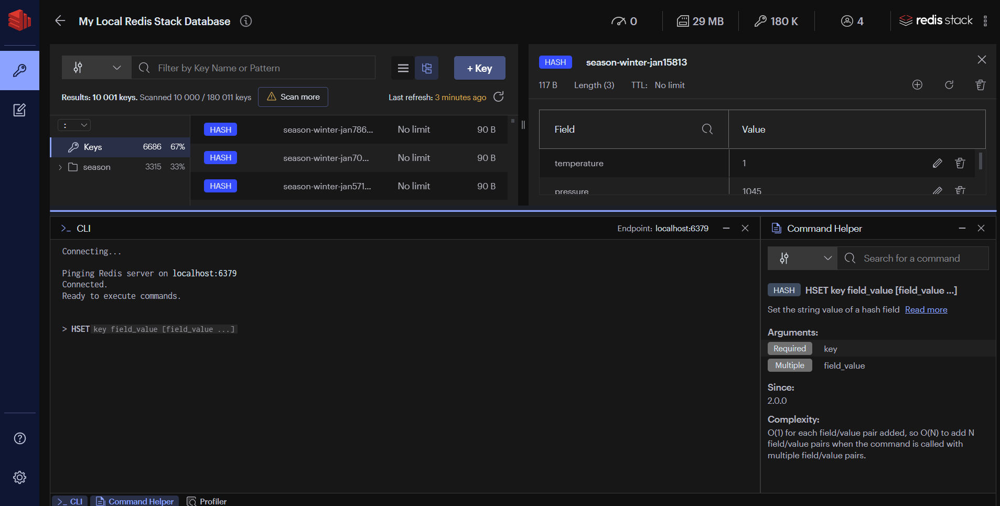

### Workbench

Workbench is an advanced command line interface with intelligent command auto-complete and complex data visualization support.
* Built-in guides: you can conveniently discover Redis and Redis Open Source features using the built-in guides.
* Command auto-complete support for all features in Redis and Redis Open Source.
* Advanced, schema-aware auto-complete for Redis Query Engine, which provides for faster query building with context-sensitive suggestions that recognize indexes, schemas, and fields based on your current query. Start typing any Redis Query Engine command in to try this feature. See below for an example of an in-progress `FT.SEARCH` command.

Workbench also includes:

* Visualizations of your indexes, queries, and aggregations.
* Visualizations of your [time series]() data.

  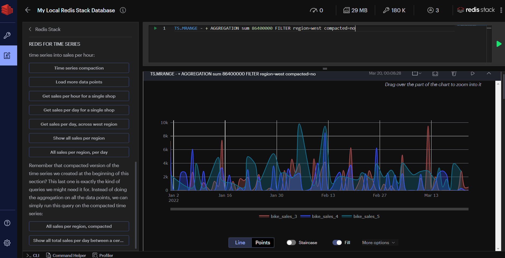

## Tools

### Database analysis

Use the database analysis tool to optimize the performance and memory usage of your Redis database. Check data type distribution and memory allocation and review the summary of key expiration time and memory to be freed over time. Inspect the top keys and namespaces sorted by consumed memory or key length and count of keys, respectively. Capture and track the changes in your database by viewing historical analysis reports. Next figure shows a sample database analysis report.


The database analysis tool will only analyze up to 10,000 keys. If more than 10,000 keys are present, the tool will attempt to use extrapolation in its analysis.


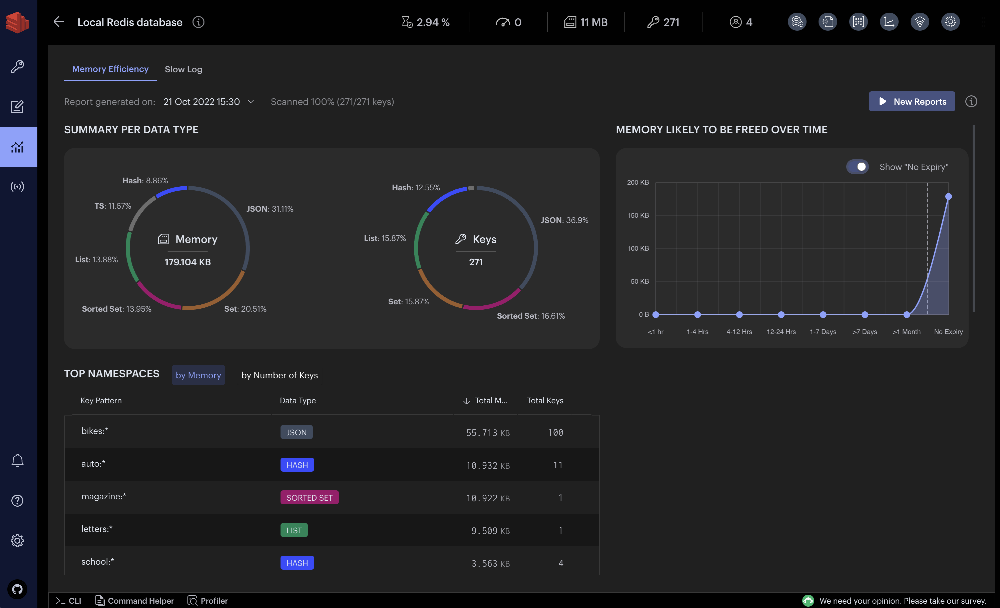

### Redis Streams support

Create and manage streams by adding, removing, and filtering entries per timestamp. To see and work with new entries, enable and customize the automatic refresh rate.

View and manage the list of consumer groups. See existing consumers in a given consumer name as well as the last messages delivered to them. Inspect the list of pending messages, explicitly acknowledge the processed items, or claim unprocessed messages via Redis Insight.

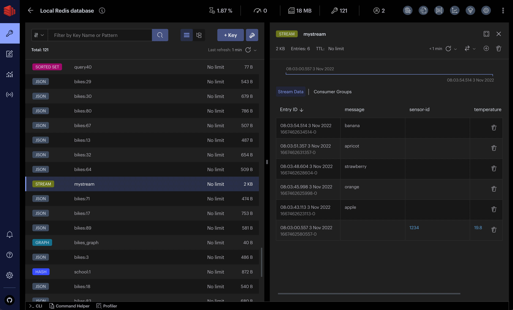

### Search features

If you're using the indexing, querying, or full-text search features of Redis Open Source, Redis Insight provides UI controls to quickly and conveniently run search queries against a preselected index. You can also create a secondary index of your data in a dedicated pane.

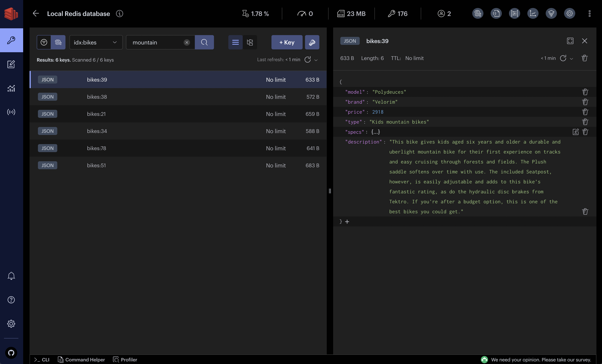

### Bulk actions

Easily and quickly delete multiple keys of the same type and/or with the same key name pattern in bulk. To do so, in the List or Tree view, set filters per key type or key names and open the Bulk Actions section. The section displays a summary of all the keys with the expected number of keys that will be deleted based on the set filters.

When the bulk deletion is completed, Redis Insight displays the results of this operation with the number of keys processed and the time taken to delete the keys in bulk.
Use bulk deletion to optimize the usage of your database based on the results from the Redis database analysis.

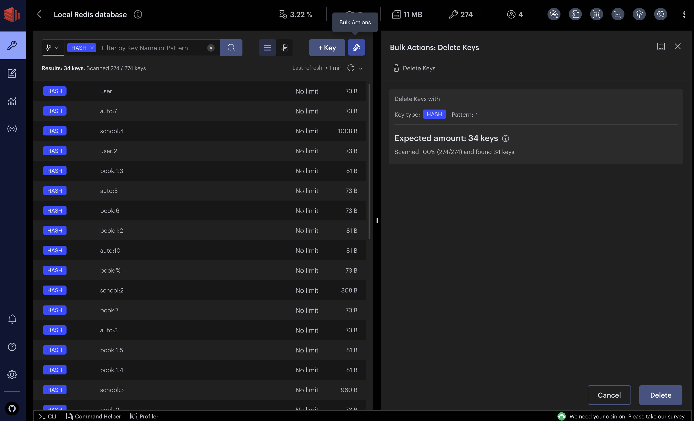

### Slow Log

The Slow Log tool displays the list of logs captured by the SLOWLOG command to analyze all commands that exceed a specified runtime, which helps with troubleshooting performance issues. Specify both the runtime and the maximum length of Slowlog (which are server configurations) to configure the list of commands logged and set the auto-refresh interval to automatically update the list of commands displayed.

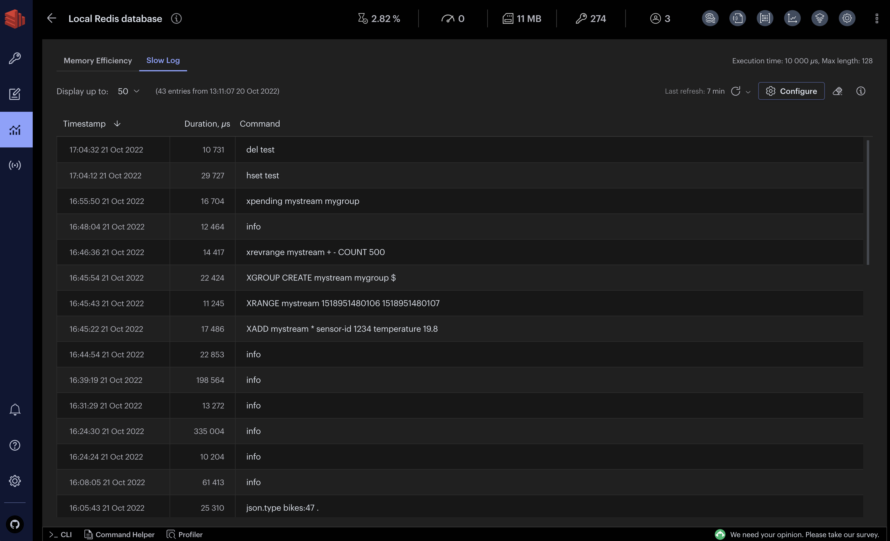

## Plugins

With Redis Insight you can now also extend the core functionality by building your own data visualizations. See our [plugin documentation](https://github.com/Redis-Insight/Redis-Insight/wiki/Plugin-Documentation) for more information.

## Telemetry

Redis Insight includes an opt-in telemetry system. This help us improve the developer experience of the app. We value your privacy; all collected data is anonymized.

## Log files

You can review the Redis Insight log files (files with a `.log` extension) to get detailed information about system issues.
These are the locations on supported platforms:

- **Docker**: In the `/data/logs` directory *inside the container*.
- **Mac**: In the `/Users/<your-username>/.redis-insight` directory.
- **Windows**: In the `C:\Users\<your-username>\.redis-insight` directory.
- **Linux**: In the `/home/<your-username>/.redis-insight` directory.


You can install Redis Insight on operating systems that are not officially supported, but it may not behave as expected.


## Redis Insight API (only for Docker)

If you are running Redis Insight from [Docker](),
you can access the API from `http://localhost:5540/api/docs`.

## Feedback

To provide your feedback, [open a ticket in our Redis Insight repository](https://github.com/Redis-Insight/Redis-Insight/issues/new).

## License

Redis Insight is licensed under [SSPL](https://github.com/Redis-Insight/Redis-Insight/blob/main/LICENSE) license.
