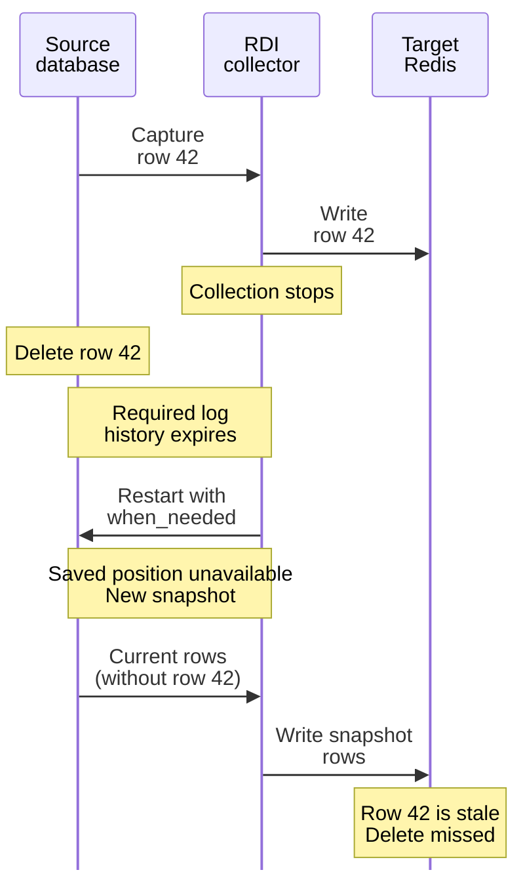

A new snapshot copies existing source rows. It does not replay missed deletes or remove
target records for rows absent from the snapshot.

The timeline shows one row whose delete event is lost before collection resumes.
Time progresses from top to bottom.

An interruption alone does not cause this gap. If the saved position and the required
log history are still available, the collector can resume and capture the delete.
In this example, the history expires before the collector resumes, and the new snapshot
contains no row 42 to overwrite or delete its target record. Streaming resumes after
the snapshot, but the stale record can remain in Redis.
