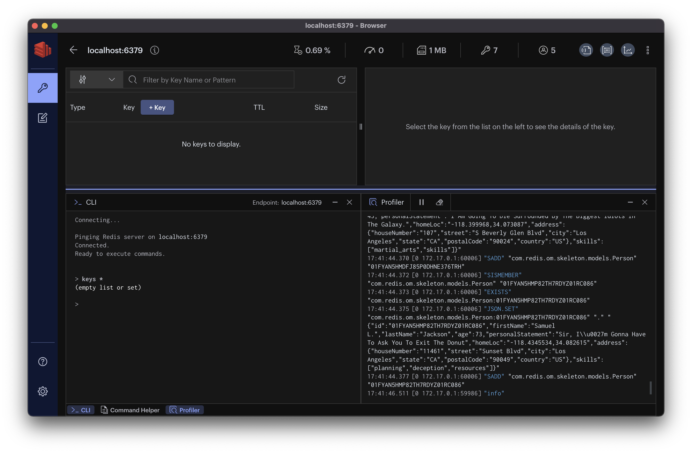
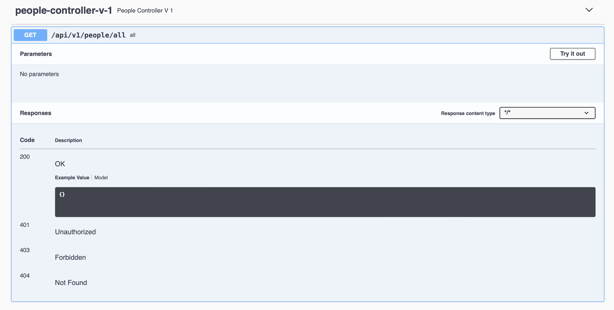
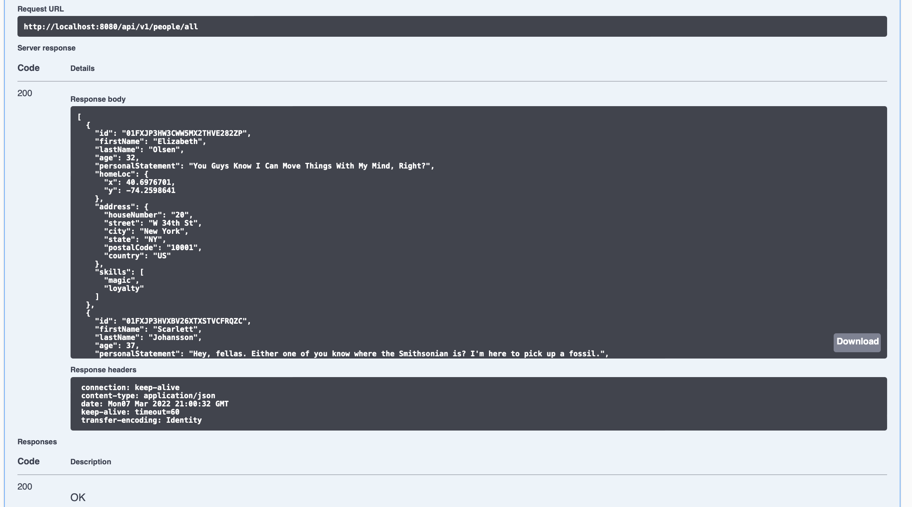
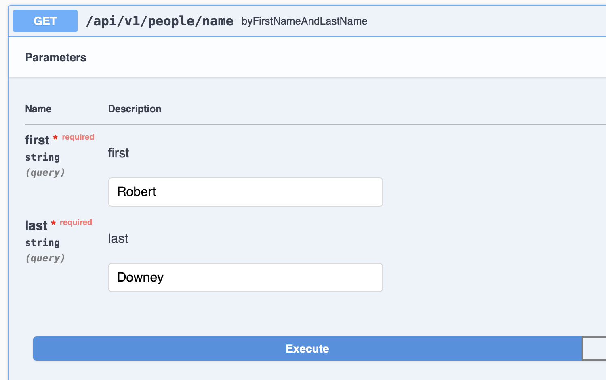
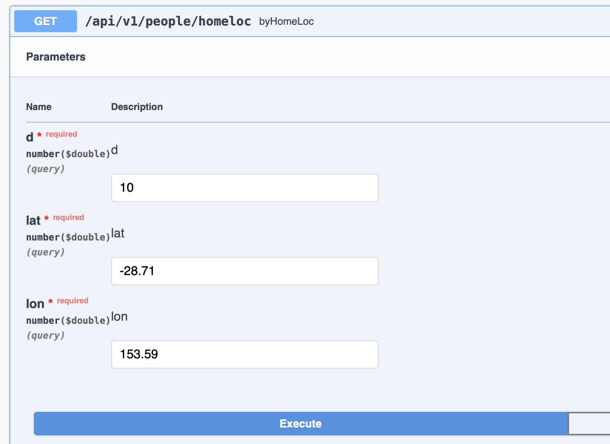
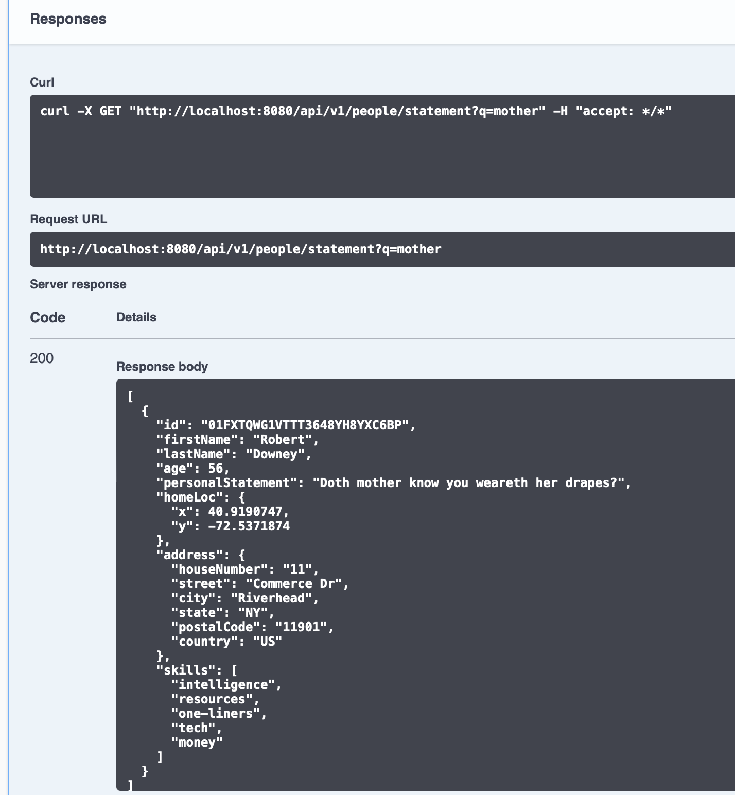
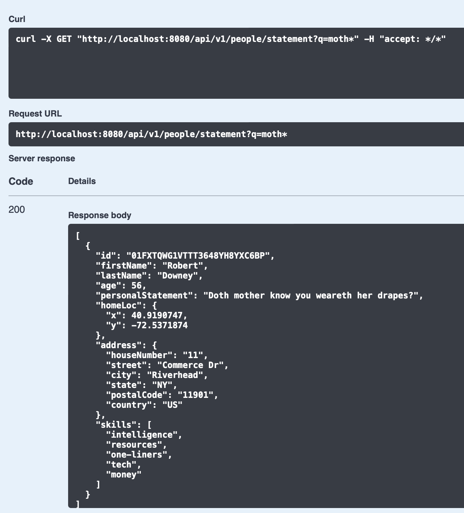
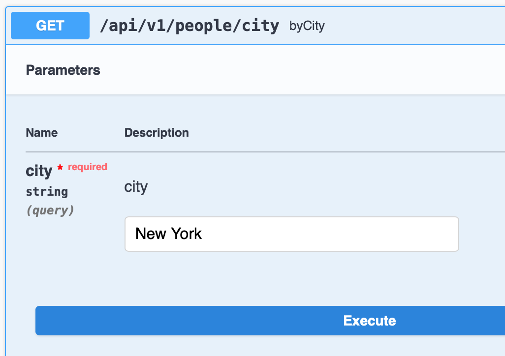

Redis Stack provides a seamless and straightforward way to use different data models and functionality from Redis, including a document store, a time series data database, probabilistic data structures, and a full-text search engine.

Redis Stack is supported by several client libraries, including Node.js, Java, and Python, so that developers can use their preferred language. We'll be using one of the Redis Stack supporting libraries; [Redis OM Spring](https://github.com/redis/redis-om-spring).
Redis OM Spring provides a robust repository and custom object-mapping abstractions built on the powerful Spring Data Redis (SDR) framework.

## What you’ll need:

* Redis Stack: See []()
* [Redis Insight]()
* Your favorite browser
* Java 11 or greater

## Spring Boot scaffold with Spring Initializer

We’ll start by creating a skeleton app using the [Spring Initializer](https://start.spring.io), open your browser to https://start.spring.io and let's configure our skeleton application as follows:

* We’ll use a Maven-based build (check Maven checkbox)
* And version **`2.6.4`** of Spring Boot which is the current version supported by Redis OM Spring
* Group: **`com.redis.om`**
* Artifact: **`skeleton`**
* Name: **`skeleton`**
* Description: Skeleton App for Redis OM Spring
* Package Name: **`com.redis.om.skeleton`**
* Packaging: JAR
* Java: **`11`**
* Dependencies: **`web`**, **`devtools`** and **`lombok`**.

The `web` (Spring Web) gives us the ability to build RESTful applications using Spring MVC. With `devtools` we get fast application restarts and reloads. And `lombok` reduces boilerplate code like getters and setters.

Click `Generate` and download the ZIP file, unzip it and load the Maven project into your IDE of choice.

## Adding Redis OM Spring

Open the Maven `pom.xml` and between the `<dependencies>` and `<build>` sections we’ll add the snapshots repositories so that we can get to latest SNAPSHOT release of redis-om-spring:


<repositories>
  <repository>
    <id>snapshots-repo</id>
    <url>https://s01.oss.sonatype.org/content/repositories/snapshots/</url>
  </repository>
</repositories>


And then in the `<dependencies>` section add version `0.3.0` of Redis OM Spring:


<dependency>
  <groupId>com.redis.om</groupId>
  <artifactId>redis-om-spring</artifactId>
  <version>0.3.0-SNAPSHOT</version>
</dependency>


## Adding Swagger

We'll use the Swagger UI to test our web services endpoint. To add Swagger 2 to a Spring REST web service, using the Springfox implementation add the following dependencies to the POM:


<dependency>
  <groupId>io.springfox</groupId>
  <artifactId>springfox-boot-starter</artifactId>
  <version>3.0.0</version>
</dependency>
<dependency>
  <groupId>io.springfox</groupId>
  <artifactId>springfox-swagger-ui</artifactId>
  <version>3.0.0</version>
</dependency>


Let's add Swagger Docker Bean to the Spring App class:


@Bean
public Docket api() {
  return new Docket(DocumentationType.SWAGGER_2)
      .select()
      .apis(RequestHandlerSelectors.any())
      .paths(PathSelectors.any())
      .build();
}


Which will pick up any HTTP endpoints exposed by our application. Add to your app's property file (src/main/resources/application.properties):


spring.mvc.pathmatch.matching-strategy=ANT_PATH_MATCHER


And finally, to enable Swagger on the application, we need to use the `EnableSwagger2` annotation, by
annotating the main application class:


@EnableSwagger2
@SpringBootApplication
public class SkeletonApplication {
  // ...
}


## Creating the Domain

Our domain will be fairly simple; `Person`s that have `Address`es. Let's start with the `Person` entity:


package com.redis.om.skeleton.models;

import java.util.Set;

import org.springframework.data.annotation.Id;
import org.springframework.data.geo.Point;

import com.redis.om.spring.annotations.Document;
import com.redis.om.spring.annotations.Indexed;
import com.redis.om.spring.annotations.Searchable;

import lombok.AccessLevel;
import lombok.AllArgsConstructor;
import lombok.Data;
import lombok.NonNull;
import lombok.RequiredArgsConstructor;

@RequiredArgsConstructor(staticName = "of")
@AllArgsConstructor(access = AccessLevel.PROTECTED)
@Data
@Document
public class Person {
  // Id Field, also indexed
  @Id
  @Indexed
  private String id;

  // Indexed for exact text matching
  @Indexed @NonNull
  private String firstName;

  @Indexed @NonNull
  private String lastName;

  //Indexed for numeric matches
  @Indexed @NonNull
  private Integer age;

  //Indexed for Full Text matches
  @Searchable @NonNull
  private String personalStatement;

  //Indexed for Geo Filtering
  @Indexed @NonNull
  private Point homeLoc;

  // Nest indexed object
  @Indexed @NonNull
  private Address address;

  @Indexed @NonNull
  private Set<String> skills;
}


The `Person` class has the following properties:

* `id`: An autogenerated `String` using [ULIDs](https://github.com/ulid/spec)
* `firstName`: A `String` representing their first or given name.
* `lastName`: A `String` representing their last or surname.
* `age`: An `Integer` representing their age in years.
* `personalStatement`: A `String` representing a personal text statement containing facts or other biographical information.
* `homeLoc`: A `org.springframework.data.geo.Point` representing the geo coordinates.
* `address`: An entity of type `Address` representing the Person's postal address.
* `skills`: A `Set<String>` representing a collection of Strings representing skills the Person possesses.

### @Document

The `Person` class (`com.redis.om.skeleton.models.Person`) is annotated with `@Document` (`com.redis.om.spring.annotations.Document`), which is marks the object as a Redis entity to be persisted as a JSON document by the appropriate type of repository.

### @Indexed and @Searchable

The fields `id`, `firstName`, `lastName`, `age`, `homeLoc`, `address`, and `skills` are all annotated
with `@Indexed` (`com.redis.om.spring.annotations.Indexed`). On entities annotated with `@Document` Redis OM Spring will scan the fields and add an appropriate search index field to the schema for the entity. For example, for the `Person` class
an index named `com.redis.om.skeleton.models.PersonIdx` will be created on application startup. In the index schema, a search field will be added for each `@Indexed` annotated property. RediSearch, the underlying search engine powering searches, supports Text (full-text searches), Tag (exact-match searches), Numeric (range queries), Geo (geographic range queries), and Vector (vector queries) fields. For `@Indexed` fields, the appropriate search field (Tag, Numeric, or Geo) is selected based on the property's data type.

Fields marked as `@Searchable` (`com.redis.om.spring.annotations.Searchable`) such as `personalStatement` in `Person` are reflected as Full-Text search fields in the search index schema.

### Nested Field Search Features

The embedded class `Address` (`com.redis.om.skeleton.models.Address`) has several properties annotated with `@Indexed`  and `@Searchable`, which will generate search index fields in Redis. The scanning of these fields is triggered by the `@Indexed` annotation on the `address` property in the `Person` class:


package com.redis.om.skeleton.models;

import com.redis.om.spring.annotations.Indexed;
import com.redis.om.spring.annotations.Searchable;

import lombok.Data;
import lombok.NonNull;
import lombok.RequiredArgsConstructor;

@Data
@RequiredArgsConstructor(staticName = "of")
public class Address {

  @NonNull
  @Indexed
  private String houseNumber;

  @NonNull
  @Searchable(nostem = true)
  private String street;

  @NonNull
  @Indexed
  private String city;

  @NonNull
  @Indexed
  private String state;

  @NonNull
  @Indexed
  private String postalCode;

  @NonNull
  @Indexed
  private String country;
}


## Spring Data Repositories

With the model in place now, we need to create the bridge between the models and the Redis, a Spring Data Repository. Like other Spring Data Repositories, Redis OM Spring data repository's goal is to reduce the boilerplate code required to implement data access significantly. Create a Java interface like:


package com.redis.om.skeleton.models.repositories;

import com.redis.om.skeleton.models.Person;
import com.redis.om.spring.repository.RedisDocumentRepository;

public interface PeopleRepository extends RedisDocumentRepository<Person,String> {

}


That's really all we need to get all the CRUD and Paging/Sorting functionality. The
`RedisDocumentRepository` (`com.redis.om.spring.repository.RedisDocumentRepository`) extends `PagingAndSortingRepository` (`org.springframework.data.repository.PagingAndSortingRepository`) which extends CrudRepository to provide additional methods to retrieve entities using the pagination and sorting.

### @EnableRedisDocumentRepositories

Before we can fire up the application, we need to enable our Redis Document repositories. Like most
Spring Data projects, Redis OM Spring provides an annotation to do so; the `@EnableRedisDocumentRepositories`. We annotate the main application class:


@EnableRedisDocumentRepositories(basePackages = "com.redis.om.skeleton.*")
@EnableSwagger2
@SpringBootApplication
public class SkeletonApplication {


## CRUD with Repositories

With the repositories enabled, we can use our repo; let's put in some data to see the object mapping in action. Let’s create `CommandLineRunner` that will execute on application startup:


public class SkeletonApplication {

 @Bean
 CommandLineRunner loadTestData(PeopleRepository repo) {
   return args -> {
     repo.deleteAll();

     String thorSays = "The Rabbit Is Correct, And Clearly The Smartest One Among You.";

     // Serendipity, 248 Seven Mile Beach Rd, Broken Head NSW 2481, Australia
     Address thorsAddress = Address.of("248", "Seven Mile Beach Rd", "Broken Head", "NSW", "2481", "Australia");

     Person thor = Person.of("Chris", "Hemsworth", 38, thorSays, new Point(153.616667, -28.716667), thorsAddress, Set.of("hammer", "biceps", "hair", "heart"));

     repo.save(thor);
   };
 }


In the `loadTestData` method, we will take an instance of the `PeopleRepository` (thank you, Spring, for Dependency Injection!). Inside the returned lambda, we will first call the repo’s `deleteAll` method, which will ensure that we have clean data on each application reload.

We create a `Person` object using the Lombok generated builder method and then save it using the repo’s `save` method.

### Keeping tabs with Redis Insight

Let’s launch Redis Insight and connect to the localhost at port 6379. With a clean Redis Stack install, we can use the built-in CLI to check the keys in the system:

For a small amount of data, you can use the `keys` command (for any significant amount of data, use `scan`):


keys *


If you want to keep an eye on the commands issued against the server, Redis Insight provides a
profiler. If you click the "profile" button at the bottom of the screen, it should reveal the profiler window, and there you can start the profiler by clicking on the "Start Profiler" arrow.

Let's start our Spring Boot application by using the Maven command:


./mvnw spring-boot:run


On Redis Insight, if the application starts correctly, you should see a barrage of commands fly by on the profiler:

Now we can inspect the newly loaded data by simply refreshing the "Keys" view:

You should now see two keys; one for the JSON document for "Thor" and one for the Redis Set that Spring Data Redis (and Redis OM Spring) use to maintain the list of primary keys for an entity.

You can select any of the keys on the key list to reveal their contents on the details panel. For JSON documents, we get a nice tree-view:

Several Redis commands were executed on application startup. Let’s break them down so that we can understand what's transpired.

### Index Creation

The first one is a call to [`FT.CREATE`](), which happens after Redis OM Spring scanned the `@Document` annotations. As you can see, since it encountered the annotation on `Person`, it creates the  `PersonIdx` index.


"FT.CREATE"
  "com.redis.om.skeleton.models.PersonIdx" "ON" "JSON"
  "PREFIX" "1" "com.redis.om.skeleton.models.Person:"
"SCHEMA"
  "$.id" "AS" "id" "TAG"
  "$.firstName" "AS" "firstName" "TAG"
  "$.lastName" "AS" "lastName" "TAG"
  "$.age" "AS" "age" "NUMERIC"
  "$.personalStatement" "AS" "personalStatement" "TEXT"
  "$.homeLoc" "AS" "homeLoc" "GEO"
  "$.address.houseNumber" "AS" "address_houseNumber" "TAG"
  "$.address.street" "AS" "address_street" "TEXT" "NOSTEM"
  "$.address.city" "AS" "address_city" "TAG"
  "$.address.state" "AS" "address_state" "TAG"
  "$.address.postalCode" "AS" "address_postalCode" "TAG"
  "$.address.country" "AS" "address_country" "TAG"
  "$.skills[*]" "AS" "skills"


### Cleaning the Person Repository

The next set of commands are generated by the call to `repo.deleteAll()`:


"DEL" "com.redis.om.skeleton.models.Person"
"KEYS" "com.redis.om.skeleton.models.Person:*"


The first call clears the set of Primary Keys that Spring Data Redis maintains (and therefore Redis OM Spring), the second call collects all the keys to delete them, but there are none to delete on this first load of the data.

### Saving Person Entities

The next repo call is `repo.save(thor)` that triggers the following sequence:


"SISMEMBER" "com.redis.om.skeleton.models.Person" "01FYANFH68J6WKX2PBPX21RD9H"
"EXISTS" "com.redis.om.skeleton.models.Person:01FYANFH68J6WKX2PBPX21RD9H"
"JSON.SET" "com.redis.om.skeleton.models.Person:01FYANFH68J6WKX2PBPX21RD9H" "." "{"id":"01FYANFH68J6WKX2PBPX21RD9H","firstName":"Chris","lastName":"Hemsworth","age":38,"personalStatement":"The Rabbit Is Correct, And Clearly The Smartest One Among You.","homeLoc":"153.616667,-28.716667","address":{"houseNumber":"248","street":"Seven Mile Beach Rd","city":"Broken Head","state":"NSW","postalCode":"2481","country":"Australia"},"skills":["biceps","hair","heart","hammer"]}
"SADD" "com.redis.om.skeleton.models.Person" "01FYANFH68J6WKX2PBPX21RD9H"


Let's break it down:

* The first call uses the generated ULID to check if the id is in the set of primary keys (if it is, it’ll be removed)
* The second call checks if JSON document exists (if it is, it’ll be removed)
* The third call uses the [`JSON.SET`]() command to save the JSON payload
* The last call adds the primary key of the saved document to the set of primary keys

Now that we’ve seen the repository in action via the `.save` method, we know that the trip from Java to Redis work. Now let’s add some more data to make the interactions more interesting:


@Bean
CommandLineRunner loadTestData(PeopleRepository repo) {
  return args -> {
    repo.deleteAll();

    String thorSays = "The Rabbit Is Correct, And Clearly The Smartest One Among You.";
    String ironmanSays = "Doth mother know you weareth her drapes?";
    String blackWidowSays = "Hey, fellas. Either one of you know where the Smithsonian is? I’m here to pick up a fossil.";
    String wandaMaximoffSays = "You Guys Know I Can Move Things With My Mind, Right?";
    String gamoraSays = "I Am Going To Die Surrounded By The Biggest Idiots In The Galaxy.";
    String nickFurySays = "Sir, I’m Gonna Have To Ask You To Exit The Donut";

    // Serendipity, 248 Seven Mile Beach Rd, Broken Head NSW 2481, Australia
    Address thorsAddress = Address.of("248", "Seven Mile Beach Rd", "Broken Head", "NSW", "2481", "Australia");

    // 11 Commerce Dr, Riverhead, NY 11901
    Address ironmansAddress = Address.of("11", "Commerce Dr", "Riverhead", "NY",  "11901", "US");

    // 605 W 48th St, New York, NY 10019
    Address blackWidowAddress = Address.of("605", "48th St", "New York", "NY", "10019", "US");

    // 20 W 34th St, New York, NY 10001
    Address wandaMaximoffsAddress = Address.of("20", "W 34th St", "New York", "NY", "10001", "US");

    // 107 S Beverly Glen Blvd, Los Angeles, CA 90024
    Address gamorasAddress = Address.of("107", "S Beverly Glen Blvd", "Los Angeles", "CA", "90024", "US");

    // 11461 Sunset Blvd, Los Angeles, CA 90049
    Address nickFuryAddress = Address.of("11461", "Sunset Blvd", "Los Angeles", "CA", "90049", "US");

    Person thor = Person.of("Chris", "Hemsworth", 38, thorSays, new Point(153.616667, -28.716667), thorsAddress, Set.of("hammer", "biceps", "hair", "heart"));
    Person ironman = Person.of("Robert", "Downey", 56, ironmanSays, new Point(40.9190747, -72.5371874), ironmansAddress, Set.of("tech", "money", "one-liners", "intelligence", "resources"));
    Person blackWidow = Person.of("Scarlett", "Johansson", 37, blackWidowSays, new Point(40.7215259, -74.0129994), blackWidowAddress, Set.of("deception", "martial_arts"));
    Person wandaMaximoff = Person.of("Elizabeth", "Olsen", 32, wandaMaximoffSays, new Point(40.6976701, -74.2598641), wandaMaximoffsAddress, Set.of("magic", "loyalty"));
    Person gamora = Person.of("Zoe", "Saldana", 43, gamoraSays, new Point(-118.399968, 34.073087), gamorasAddress, Set.of("skills", "martial_arts"));
    Person nickFury = Person.of("Samuel L.", "Jackson", 73, nickFurySays, new Point(-118.4345534, 34.082615), nickFuryAddress, Set.of("planning", "deception", "resources"));

    repo.saveAll(List.of(thor, ironman, blackWidow, wandaMaximoff, gamora, nickFury));
  };
}


We have 6 People in the database now; since we’re using the devtools in Spring, the app should have reloaded, and the database reseeded with new data. Press enter the key pattern input box in Redis Insight to refresh the view. Notice that we used the repository’s `saveAll` to save several objects in bulk.

## Web Service Endpoints

Before we beef up the repository with more interesting queries, let’s create a controller so that we can test our queries using the Swagger UI:


package com.redis.om.skeleton.controllers;

import com.redis.om.skeleton.models.Person;
import com.redis.om.skeleton.models.repositories.PeopleRepository;

import org.springframework.beans.factory.annotation.Autowired;
import org.springframework.web.bind.annotation.GetMapping;
import org.springframework.web.bind.annotation.RequestMapping;
import org.springframework.web.bind.annotation.RestController;

@RestController
@RequestMapping("/api/v1/people")
public class PeopleControllerV1 {
 @Autowired
 PeopleRepository repo;

 @GetMapping("all")
 Iterable<Person> all() {
   return repo.findAll();
 }
}


In this controller, we inject a repository and use one of the CRUD methods, `findAll()`, to return all the `Person` documents in the database.

If we navigate to http://localhost:8080/swagger-ui/ you should see the Swagger UI:

We can see the `/all` method from our people-controller-v-1, expanding that you should see:

And if you select "Try it out" and then "Execute," you should see the resulting JSON array containing all People documents in the database:

Let’s also add the ability to retrieve a Person by its id by using the repo’s findById method:


@GetMapping("{id}")
Optional<Person> byId(@PathVariable String id) {
  return repo.findById(id);
}


Refreshing the Swagger UI, we should see the newly added endpoint. We can grab an id using the [`SRANDMEMBER`]() command on the Redis Insight CLI like this:


SRANDMEMBER com.redis.om.skeleton.models.Person


Plugging the resulting ID in the Swagger UI, we can get the corresponding  JSON document:

## Custom Repository Finders

Now that we tested quite a bit of the CRUD functionality, let's add some custom finders to our repository. We’ll start with a finder over a numeric range, on the `age` property of `Person`:


public interface PeopleRepository extends RedisDocumentRepository<Person,String> {
 // Find people by age range
 Iterable<Person> findByAgeBetween(int minAge, int maxAge);
}


At runtime, the repository method `findByAgeBetween` is fulfilled by the framework, so all you need to do is declare it, and Redis OM Spring will handle the querying and mapping of the results. The property or properties to be used are picked after the key phrase "findBy". The "Between" keyword is the predicate that tells the query builder what operation to use.

To test it on the Swagger UI, let’s add a corresponding method to the controller:


@GetMapping("age_between")
Iterable<Person> byAgeBetween( //
    @RequestParam("min") int min, //
    @RequestParam("max") int max) {
  return repo.findByAgeBetween(min, max);
}


Refreshing the UI, we can see the new endpoint. Let’s try it with some data:

Invoke the endpoint with the value `30` for `min` and `37` for `max` we get two hits;
"Scarlett Johansson" and "Elizabeth Olsen" are the only two people with ages between 30 and 37.

If we look at the Redis Insight Profiler, we can see the resulting query, which is a range query on the index numeric field `age`:

We can also create query methods with more than one property. For example, if we wanted to do a query by first and last names, we would declare a repository method like:


// Find people by their first and last name
Iterable<Person> findByFirstNameAndLastName(String firstName, String lastName);


Let’s add a corresponding controller method:


@GetMapping("name")
Iterable<Person> byFirstNameAndLastName(@RequestParam("first") String firstName, //
    @RequestParam("last") String lastName) {
  return repo.findByFirstNameAndLastName(firstName, lastName);
}


Once again, we can refresh the swagger UI and test the newly created endpoint:

Executing the request with the first name `Robert` and last name `Downey`, we get:

And the resulting query on Redis Insight:

Now let’s try a Geospatial query. The `homeLoc` property is a Geo Point, and by using the "Near" predicate in our method declaration, we can get a finder that takes a point and a radius around that point to search:


// Draws a circular geofilter around a spot and returns all people in that
// radius
Iterable<Person> findByHomeLocNear(Point point, Distance distance);
And the corresponding controller method:

@GetMapping("homeloc")
Iterable<Person> byHomeLoc(//
    @RequestParam("lat") double lat, //
    @RequestParam("lon") double lon, //
    @RequestParam("d") double distance) {
  return repo.findByHomeLocNear(new Point(lon, lat), new Distance(distance, Metrics.MILES));
}


Refreshing the Swagger US, we should now see the `byHomeLoc` endpoint. Let’s see which of the Avengers live within 10 miles of Suffolk Park Pub in South Wales, Australia... hmmm.

Executing the request, we get the record for Chris Hemsworth:

and in Redis Insight we can see the backing query:

Let’s try a full-text search query against the `personalStatement` property. To do so, we prefix our query method with the word `search` as shown below:


// Performs full-text search on a person’s personal Statement
Iterable<Person> searchByPersonalStatement(String text);


And the corresponding controller method:


@GetMapping("statement")
Iterable<Person> byPersonalStatement(@RequestParam("q") String q) {
  return repo.searchByPersonalStatement(q);
}


Once again, we can try it on the Swagger UI with the text "mother":

Which results in a single hit, the record for Robert Downey Jr.:

Notice that you can pass a query string like "moth*" with wildcards if needed

### Nested object searches

You’ve noticed that the `address` object in `Person` is mapped as a JSON object. If we want to search by address fields, we use an underscore to access the nested fields. For example, if we wanted to find a Person by their city, the method signature would be:


// Performing a tag search on city
Iterable<Person> findByAddress_City(String city);


Let’s add the matching controller method so that we can test it:


@GetMapping("city")
Iterable<Person> byCity(@RequestParam("city") String city) {
  return repo.findByAddress_City(city);
}


Let’s test the byCity endpoint:

As expected, we should get two hits; Scarlett Johansson and Elizabeth Olsen, both with addresses in Nee York:

The skills set is indexed as tag search. To find a Person with any of the skills in a provided list, we can add a repository method like:


// Search Persons that have one of multiple skills (OR condition)
Iterable<Person> findBySkills(Set<String> skills);


And the corresponding controller method:


@GetMapping("skills")
Iterable<Person> byAnySkills(@RequestParam("skills") Set<String> skills) {
  return repo.findBySkills(skills);
}


Let's test the endpoint with the value "deception":

The search returns the records for Scarlett Johansson and Samuel L. Jackson:

We can see the backing query using a tag search:

## Fluid Searching with Entity Streams

Redis OM Spring Entity Streams provides a Java 8 Streams interface to Query Redis JSON documents using Redis Stack. Entity Streams allow you to process data in a typesafe declarative way similar to SQL statements. Streams can be used to express a query as a chain of operations.

Entity Streams in Redis OM Spring provide the same semantics as Java 8 streams. Streams can be made of Redis Mapped entities (`@Document`) or one or more properties of an Entity. Entity Streams progressively build the query until a terminal operation is invoked (such as `collect`). Whenever a Terminal operation is applied to a Stream, the Stream cannot accept additional operations to its pipeline, which means that the Stream is started.

Let’s start with a simple example, a Spring `@Service` which includes `EntityStream` to query for instances of the mapped class `Person`:


package com.redis.om.skeleton.services;

import java.util.stream.Collectors;

import org.springframework.beans.factory.annotation.Autowired;
import org.springframework.stereotype.Service;

import com.redis.om.skeleton.models.Person;
import com.redis.om.skeleton.models.Person$;
import com.redis.om.spring.search.stream.EntityStream;

@Service
public class PeopleService {
  @Autowired
  EntityStream entityStream;

  // Find all people
  public Iterable<Person> findAllPeople(int minAge, int maxAge) {
    return entityStream //
        .of(Person.class) //
        .collect(Collectors.toList());
  }

}


The `EntityStream` is injected into the `PeopleService` using `@Autowired`. We can then get a stream for `Person` objects by using `entityStream.of(Person.class)`. The stream represents the equivalent of a `SELECT * FROM Person` on a relational database. The call to `collect` will then execute the underlying query and return a collection of all `Person` objects in Redis.

### Entity Meta-model

You’re provided with a generated meta-model to produce more elaborate queries, a class with the same name as your model but ending with a dollar sign. In the
example below, our entity model is `Person`; therefore, we get a meta-model named `Person$`. With the meta-model, you have access to the
underlying search engine field operations. For example, we have an `age` property which is an integer. Therefore our meta-model has an `AGE` property with
numeric operations we can use with the stream’s `filter` method such as `between`.


// Find people by age range
public Iterable<Person> findByAgeBetween(int minAge, int maxAge) {
  return entityStream //
      .of(Person.class) //
      .filter(Person$.AGE.between(minAge, maxAge)) //
      .sorted(Person$.AGE, SortOrder.ASC) //
      .collect(Collectors.toList());
}


In this example, we also use the Streams `sorted` method to declare that our stream will be sorted by the `Person$.AGE` in `ASC`ending order.

To "AND" property expressions we can chain multiple `.filter` statements. For example, to recreate
the finder by first and last name we can use an Entity Stream in the following way:


// Find people by their first and last name
public Iterable<Person> findByFirstNameAndLastName(String firstName, String lastName) {
  return entityStream //
      .of(Person.class) //
      .filter(Person$.FIRST_NAME.eq(firstName)) //
      .filter(Person$.LAST_NAME.eq(lastName)) //
      .collect(Collectors.toList());
}


In this article, we explored how Redis OM Spring provides a couple of APIs to tap into the power of Redis Stack’s document database and search features from Spring Boot application. We’ll explore other Redis Stack features via Redis OM Spring in future articles

