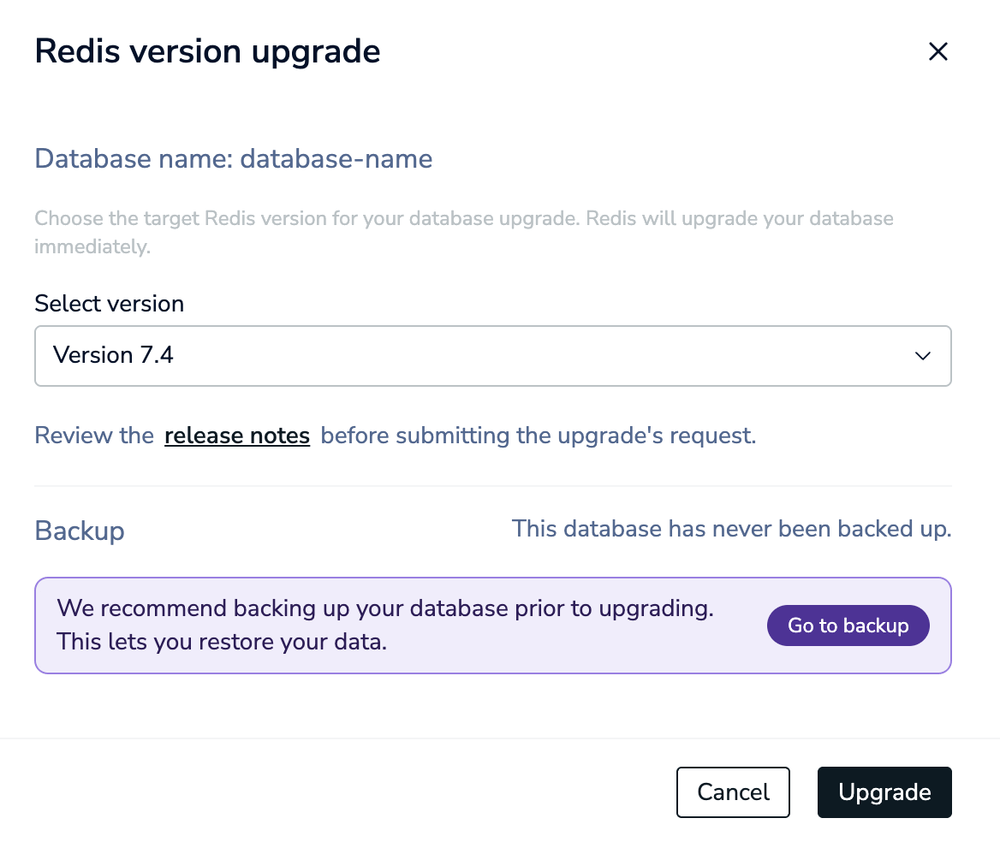
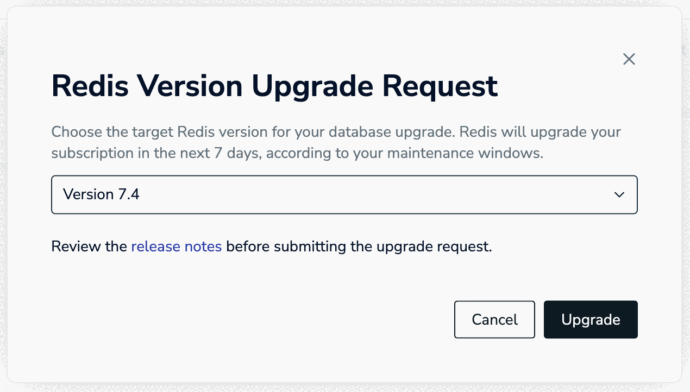

You can upgrade databases that are not on the latest available version of Redis to a later version at any time.


Please keep in mind the following before upgrading your database version:

- We recommend that you [back up your data]() before upgrading to make it easier to [manually revert the upgrade](#manually-revert-upgrade) if needed.

- We recommend that you upgrade your database during off-peak hours or during application maintenance to minimize reconnections.

- Review the breaking changes for the new database version before upgrading: 
    - [Redis 7.2]() 
    - [Redis 7.4]()
    - [Redis 8.0]()
    - [Redis 8.2]()

- You must upgrade the target database in an [Active-Passive]() setup before you upgrade the source database to prevent compatibility issues.


## Upgrade database



To upgrade a single-region Redis Cloud database: 

1. Choose your database from the **Databases** list to open your database page. Select **More actions > Version upgrade**.

    
    
    You can also select **More actions > Version upgrade** from the database list.

1. Select the target version from the **Select version** list.

    

    If your database has not been backed up before, we recommend that you back up your database. Select **Go to backup** to go to the [backup settings]().

1. Select **Upgrade Now** to start the upgrade.

    

The database will start upgrading to the selected version immediately. The upgrade may take a few minutes. 

You can continue to use the Redis Cloud console for other tasks during the upgrade.

-tab-sep-

To request to upgrade all databases in an [Active-Active]() subscription:

1. Choose your Active-Active subscription from the **Subscriptions** list to open your subscription page. Select **Version upgrade**.

    

1. Select the version to upgrade your databases from the list and select **Upgrade** to submit the upgrade request.

    

The upgrade will start in 1-3 weeks from your request, according to your subscription's [maintenance windows](). All databases in the subscription will be upgraded to the same version.



## Manually revert upgrade

Automatically reverting to a previous Redis version is not supported on Redis Cloud.

If you [backed up your database]() before you upgraded your version, you can:

1. [Delete your database]() without deleting your subscription.
1. [Create a new database]() in your subscription with the following settings:
    - **Port number**: Use the same port number as the old database.
    - **Version**: Select the original version of Redis.
1. [Import the backup files]() into the new database.

This allows you to connect to the database on the previous version without changing your connection details in your application.

If you did not back up your database before upgrading:

1. [Back up your database]().
1. [Create a new database]() in your subscription and select the original version of Redis.
1. [Import the backup files]() into the new database.
1. Change connection details in your application from the old database to the new database.