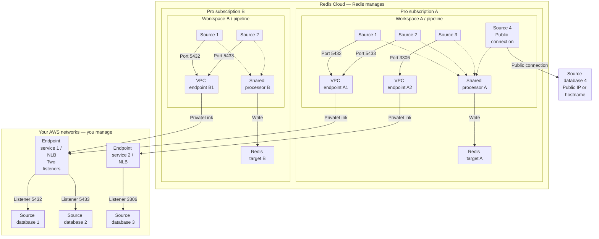

Configure connectivity for each source in your Data Integration pipeline. Sources can share an Amazon Web Services (AWS) PrivateLink endpoint service or use separate services. They can also use public endpoints where the [source requirements](/content/operate/rc/rdi/_index.md#prerequisites) permit them.

## Workspaces, sources, and targets

Create one Data Integration workspace for each Pro subscription that needs a pipeline. All sources in a pipeline write to one target Redis database in that subscription. To write to targets in different subscriptions, set up a workspace and pipeline in each subscription.

Redis Cloud manages the workspace and its virtual private cloud (VPC) endpoints. A public source uses an Internet Protocol (IP) address or hostname. For a customer-managed source, you manage the endpoint service, Network Load Balancer (NLB), and database access rules. The endpoint service must be in the same AWS region as the workspace.

The example shows two subscriptions connecting to the same customer endpoint service. Subscription A also connects to a separate service and a public hostname. All resources in this example use the same AWS region.

Source boxes are configured sources in the pipeline, not the source databases. Solid arrows show initiated network connections. Dotted arrows show data passed from each source to its shared processor. The processor writes the data to the pipeline's Redis target. Source 4 connects directly to a public IP address or hostname, without PrivateLink. The listener ports are examples. A listener can forward to a different database port.

## Choose your connectivity setup

| Your setup | What you configure |
|:--|:--|
| Several databases behind one NLB | Use a separate listener port and target group for each database. Enter the same endpoint service name for each source, with its matching listener port. Redis Cloud reuses the workspace's endpoint for that service. |
| Databases in separate networks | Use separate endpoint services when one NLB cannot privately reach all databases. Configure the matching service for each source. Your source networks do not need to connect to each other. |
| The same source feeds several subscriptions | You can reuse your endpoint service and NLB. Each workspace needs its own VPC endpoint connection. Allow the principal shown for each workspace and accept each new connection. Configure and test the source in each pipeline. |
| Private and public sources in one pipeline | Choose connectivity separately for each source. For public sources, allow the outbound IP addresses shown in that workspace's console. |

Sharing an endpoint service does not share source configuration. Each source still needs its own connection details, credentials, and data selection. A second subscription does not reuse the first workspace's VPC endpoint.

## Set up customer-managed PrivateLink

1. [Create the NLB and endpoint service](/content/operate/rc/rdi/setup.md#set-up-connectivity). For shared connectivity, add a listener and target group for each database.
1. Allow the Redis Cloud principal shown in the console for each workspace that will connect.
1. [Configure each source](/content/operate/rc/rdi/define.md#source-connectivity) with its endpoint service name. Use the matching listener port in the source configuration.
1. Accept each new endpoint connection in your AWS endpoint service. Sources sharing an existing workspace endpoint do not need a new acceptance.
1. Share each source's [credentials](/content/operate/rc/rdi/setup.md#share-source-database-credentials).
1. Select **Test source** for every source.

You manage routes from the NLB to its database targets, database access rules, and target updates after failover. See the [AWS PrivateLink reference](/content/operate/rc/rdi/networking/aws-privatelink.md) for address visibility, databases outside the VPC, and failover.

## Managed source providers

MongoDB Atlas manages its endpoint service. Follow the [Atlas setup steps](/content/operate/rc/rdi/setup.md#set-up-connectivity): give Redis Cloud the Atlas service ID, then register the returned VPC endpoint ID in Atlas. Repeat the handshake for each workspace connection.

Provider requirements still apply. Snowflake is in Preview and must be hosted on AWS. Supabase AWS PrivateLink connectivity is not supported. Check the [source requirements](/content/operate/rc/rdi/_index.md#prerequisites) and [source setup instructions](/content/operate/rc/rdi/setup.md) before choosing connectivity.
