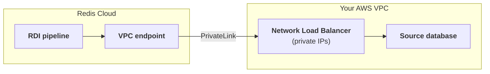
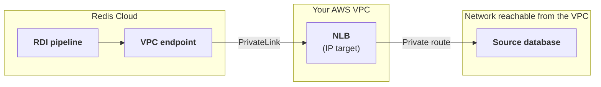

This page explains how a Data Integration pipeline reaches your source database over AWS PrivateLink, and how to keep the connection available when your database fails over. For the steps to create the PrivateLink connection, see [Set up connectivity]().

## How traffic flows {#how-traffic-flows}

With PrivateLink, the pipeline and your database are in separate address spaces that never mix. Each component only connects to one address, and that address does not change during a failover.

The following table shows which address each component sees:

| Component | Connects to | What it sees |
|:--|:--|:--|
| RDI pipeline | The VPC endpoint for your endpoint service | Only the endpoint's addresses, which come from the workspace CIDR. It never sees your database's real IP address. |
| Network Load Balancer | The registered target (instance or IP address) | Your database's real address. The target group is the only place where that address appears, and the only thing that changes during a failover. |
| Source database | Nothing. It only receives connections. | Incoming connections from the **NLB's private IP addresses**, and never from Redis Cloud addresses. Allow the NLB subnets in your database's firewall or allow list. |

Your database always receives the connection from the NLB's own private IP address, never from a Redis Cloud address. PrivateLink and the NLB rewrite the source address as the traffic passes through (network address translation), so Redis Cloud addresses are never visible anywhere in your network. The only firewall rule your database needs is to allow connections from the NLB's subnets.

Because PrivateLink translates addresses instead of routing between the two networks, the workspace CIDR can overlap with your own VPC or on-premises ranges without any conflict. It only needs to be valid on the Redis Cloud side. See [Create a Data Integration workspace]() for the workspace CIDR requirements.

## Connect to a database outside the VPC {#connect-to-a-database-outside-the-vpc}

Your source database does not have to run inside the VPC. It can be anywhere your VPC can privately route to, such as an on-premises data center reached over [AWS Direct Connect](https://aws.amazon.com/directconnect/) or a [Site-to-Site VPN](https://docs.aws.amazon.com/vpn/latest/s2svpn/VPC_VPN.html), or another network reachable through your VPC's routing.

The core rule is the same in every case: the NLB uses an IP address target that is reachable from the VPC, and the database receives the connection from the NLB's private IP address. The database never sees a Redis Cloud address.

To set this up:

- When you [create the network load balancer](), create a target group with target type **IP addresses** and register the database's IP address.
- Make sure the VPC can route to that IP address and port, and that the database's firewall or allow list accepts connections from the NLB's subnets.

## Why failover needs an IP address update {#automate-failover}

The NLB target group points to one database address at a time. If your database moves to another server, its address changes, but the target group still points to the old address, so the pipeline can no longer reach the database. This happens, for example, when a high availability replica is promoted, or when a disaster recovery server is restored from backup with a new IP address.

To recover, the NLB target group must be updated to point to the new address. This is the only change needed. Nothing changes on the Redis Cloud side: the pipeline keeps connecting to the same VPC endpoint, retries while the path is down, and catches up automatically once the target group points to a healthy server.

How you update the target group depends on your database:

- **AWS RDS or Aurora**: Use the Lambda function that responds to RDS failover events and updates the target group automatically. To set it up, see [Set up connectivity](), select the **AWS RDS or Aurora** tab, and follow **Set up Lambda function connectivity**.
- **Self-managed database (EC2 or on premises)**: Update the target group from your own failover process. You can trigger the update from your database's failover events or from the NLB's health checks.
