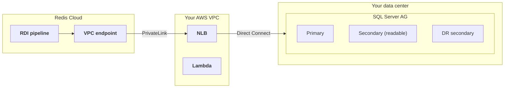

This guide shows how to connect a data pipeline to a self-managed SQL Server deployment that uses an [Always On availability group](https://learn.microsoft.com/en-us/sql/database-engine/availability-groups/windows/overview-of-always-on-availability-groups-sql-server), and what to do when the deployment fails over. Redis validated every failover scenario in this guide against a live pipeline reading from SQL Server 2022.

## Topology

The setup in this guide uses:

- A SQL Server Always On availability group with a primary replica and one or more readable secondary replicas. The replicas can be spread across sites for disaster recovery. For example, a primary and a secondary in the main site and another secondary in a recovery site, all in the same availability group.
- A [Network Load Balancer and PrivateLink endpoint service]() in your AWS VPC. The NLB target group points to the replica that the pipeline should read from, which is usually a readable secondary. If the replicas are on premises, the NLB reaches them over AWS Direct Connect.
- A Lambda function that updates the NLB target group when the deployment fails over. See [Automate the NLB update](#automate-the-nlb-update).



### Why an NLB and not the availability group listener

An availability group listener cannot replace the NLB in this setup, for two reasons:

- The pipeline can only reach the one address that PrivateLink exposes. Read-only routing through a listener works by redirecting the client to the secondary replica's own address, and that address is not reachable through PrivateLink.
- A listener requires a Windows Server Failover Cluster. Availability groups with `CLUSTER_TYPE = NONE` cannot have a listener at all.

The listener can still be useful inside your own network. For example, the Lambda function can resolve the listener DNS name to find the address of a replica after a failover.

## Connect to a readable secondary

To make the pipeline read from a readable secondary instead of the primary, add the following property to the collector in your [pipeline configuration]():

```yaml
driver.applicationIntent: ReadOnly
```

This property changes two things in the collector:

- The initial snapshot uses snapshot isolation instead of table locks, because a read-only replica does not allow locks. Readable secondaries in an availability group support snapshot isolation automatically.
- The collector refreshes its view of the change tables on every poll, so it always sees new changes.

Keep the following in mind:

- The property is safe during failover. If the replica that the pipeline reads from is promoted to primary, the connection keeps working. A primary accepts connections with `ApplicationIntent=ReadOnly`.
- Only use this property when the pipeline connects to a readable secondary in an availability group. On a standalone server, the initial snapshot fails with the error `Snapshot isolation transaction failed accessing database ... because snapshot isolation is not allowed in this database` unless you enable snapshot isolation first. See [Recover from a restore](#recover-after-a-restore-from-backup) for the fix.
- Leave the availability group's primary role connection setting at its default (`ALLOW_CONNECTIONS = ALL`). If you set the primary role to `READ_WRITE`, the primary rejects read-intent connections, and the pipeline cannot fall back to the primary when no readable secondary is available.

## What happens during a failover

Redis tested the following scenarios against a live pipeline. In all of them, the pipeline needs no restart, redeploy, or configuration change:

| Scenario | What happens |
|:--|:--|
| The secondary that the pipeline reads from is promoted to primary | The connection drops at promotion. The collector reconnects in about 10 seconds, resumes from its saved position, and skips the snapshot. No events are lost or duplicated. |
| The node is demoted back to a readable secondary | Same behavior. The collector reconnects and resumes from its saved position. |
| The replica that the pipeline reads from goes down and the NLB is repointed to another replica | The pipeline retries while the path is down, reconnects through the unchanged PrivateLink once the NLB points to a healthy replica, and catches up completely. |
| The servers are restored from a backup | This scenario is different and needs manual action. See [Recover after a restore from backup](#recover-after-a-restore-from-backup). |

The pipeline delivers events at least once. After a crash recovery, the collector can redeliver a small batch of already delivered events, and the target absorbs them by key.

### Create the CDC jobs on a promoted replica

There is one required action on the SQL Server side after every promotion. The promoted replica does not capture new changes until you create the CDC jobs on it:

```sql
USE <database>;
EXEC sys.sp_cdc_add_job @job_type = N'capture';
EXEC sys.sp_cdc_add_job @job_type = N'cleanup';
```

The availability group replicates the user database, including the CDC change tables and their history. It does not replicate the `msdb` system database, where the CDC capture and cleanup jobs live. This is [documented SQL Server behavior](https://learn.microsoft.com/en-us/sql/database-engine/availability-groups/windows/replicate-track-change-data-capture-always-on-availability).

Until the capture job exists on the new primary, no new change events are produced, and the pipeline shows no error. The data flow just stops. Ask your database administrator to automate this step as part of the failover procedure.

## Automate the NLB update

When a replica fails, something must point the NLB target group at another replica. You can automate this with a Lambda function. There are two ways to trigger it:

- **Event-driven**: When the deployment fails over, a script on any SQL Server node publishes to an SNS topic, and the SNS topic invokes the Lambda function. The Lambda function resolves a known address, such as the availability group listener DNS name, to find the replica to register in the target group. This avoids the detection delay of health checks.

    
Verify what the listener DNS name resolves to in your deployment before you rely on it. A listener DNS name usually resolves to the listener's virtual IP address, which routes to the primary replica. In that case the pipeline reads from the primary after the failover, which works, but the read load moves off the secondary.
    

- **Health-check driven**: The NLB's own health checks detect the failure and trigger the Lambda function through a CloudWatch alarm. The Lambda function finds the replacement server, for example by an EC2 tag. This needs no changes on the SQL Server side, but detection takes several minutes.

With either trigger, add an email subscription to the SNS topic so that a person always knows a failover happened. This matters most for the restore scenario below, which needs a manual follow-up.

## Recover after a restore from backup

If the SQL Server is restored from a backup, for example when a disaster recovery site starts from restored virtual machines, **always [reset the pipeline]()** after the restore.

The pipeline cannot detect this situation on its own. Its saved position in the SQL Server transaction log is newer than anything the restored database contains. The collector connects and looks healthy, but it delivers nothing. Worse, once the restored server's log positions catch up with the saved position, delivery resumes and every change made below the old position is silently skipped.

To check for this state, compare the newest change position on the server with the pipeline's saved position. Run this on the SQL Server:

```sql
USE <database>;
SELECT sys.fn_cdc_get_max_lsn();
```

If the result is lower than the pipeline's saved position, or if the target row counts stay frozen while the source is taking writes, the pipeline is stalled and needs a reset.

Before you reset, enable snapshot isolation on the restored database if it runs standalone:

```sql
ALTER DATABASE <database> SET ALLOW_SNAPSHOT_ISOLATION ON;
```

A readable secondary in an availability group provides snapshot isolation automatically, but a standalone restored server does not. Without it, the reset snapshot fails and retries until you run this command. After you run it, the collector recovers on the next retry by itself.

The reset creates a new baseline snapshot of the restored database and then streams new changes normally.
