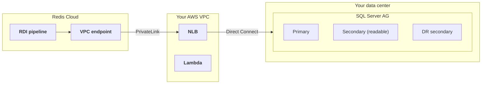

This guide shows how to connect a data pipeline to a self-managed Microsoft SQL Server deployment that uses an [Always On availability group](https://learn.microsoft.com/en-us/sql/database-engine/availability-groups/windows/overview-of-always-on-availability-groups-sql-server), and what to do when the deployment fails over. Self-managed means you run SQL Server yourself, on your own servers on-premises or on EC2 instances, rather than through a managed service such as Amazon RDS.

## Topology

The setup in this guide uses:

- A SQL Server Always On availability group with a primary replica and one or more readable secondary replicas. The replicas can be in more than one site for disaster recovery.
- A [Network Load Balancer and PrivateLink endpoint service]() in your AWS VPC. The NLB target group points to the replica that the pipeline should read from, which is usually a readable secondary. If the replicas are on premises, the NLB reaches them over AWS Direct Connect.
- A Lambda function that updates the NLB target group when the deployment fails over. See [Automate the NLB update](#automate-the-nlb-update).



### Why an NLB and not the availability group listener

An availability group listener cannot replace the NLB in this setup, for two reasons:

- The pipeline can only reach the one address that PrivateLink exposes. Read-only routing through a listener works by redirecting the client to the secondary replica's own address, and that address is not reachable through PrivateLink.
- A listener requires a Windows Server Failover Cluster. Availability groups with `CLUSTER_TYPE = NONE` cannot have a listener at all.

The listener can still be useful inside your own network. For example, the Lambda function can resolve the listener DNS name to find the address of a replica after a failover.

## Connect to a readable secondary

To make the pipeline read from a readable secondary instead of the primary, add the following property to the collector in your [pipeline configuration]():

```yaml
driver.applicationIntent: ReadOnly
```

This property changes two things in the collector:

- The initial snapshot uses snapshot isolation instead of table locks, because a read-only replica does not allow locks. Readable secondaries in an availability group support snapshot isolation automatically.
- The collector refreshes its view of the change tables on every poll, so it always sees new changes.

Keep the following in mind:

- The property is safe during failover. If the readable secondary the pipeline reads from is promoted to primary, the pipeline keeps working: it reconnects and resumes streaming from its saved position without taking a new snapshot, so the snapshot isolation requirement below does not apply to the failover itself. A primary accepts connections with `ApplicationIntent=ReadOnly`.
- With this property set, the initial snapshot uses snapshot isolation, which requires `ALLOW_SNAPSHOT_ISOLATION` to be enabled on the source database. A readable secondary in an availability group provides this automatically, so no action is needed for the normal setup. Any other database does not have it enabled by default, so if the pipeline ever takes an initial snapshot against a primary or a standalone server (for example after a [restore from backup](#recover-after-a-restore-from-backup)), enable it first with `ALTER DATABASE <database> SET ALLOW_SNAPSHOT_ISOLATION ON`.
- Leave the availability group's primary role connection setting at its default of `ALL`. If you set the primary role to `READ_WRITE`, the primary refuses connections that request `ApplicationIntent=ReadOnly`, so the pipeline cannot fall back to the primary when no readable secondary is available. See the `ALLOW_CONNECTIONS` options in [CREATE AVAILABILITY GROUP](https://learn.microsoft.com/en-us/sql/t-sql/statements/create-availability-group-transact-sql).

## What happens during a failover

The pipeline behaves as follows during a failover. In all of these scenarios, it needs no restart, redeploy, or configuration change:

| Scenario | What happens |
|:--|:--|
| The secondary that the pipeline reads from is promoted to primary | The connection drops at promotion. After a brief interruption, the collector reconnects automatically, resumes from its saved position, and skips the snapshot. No data is lost. The new primary also needs its CDC jobs created before it produces changes. See [Create the CDC jobs on a promoted replica](#create-the-cdc-jobs-on-a-promoted-replica). |
| The node is demoted back to a readable secondary | Same behavior. The collector reconnects and resumes from its saved position. |
| The replica that the pipeline reads from goes down and the NLB is repointed to another replica | The pipeline retries while the path is down, reconnects through the unchanged PrivateLink once the NLB points to a healthy replica, and catches up completely. |
| A database is restored from a backup older than the pipeline's saved position | The restored database is behind the pipeline, so reset the pipeline afterward. See [Disaster recovery and restoring from backup](#recover-after-a-restore-from-backup). |

The pipeline delivers events at least once. After a crash recovery, the collector can redeliver a small batch of already delivered events, and the target absorbs them by key.

### Create the CDC jobs on a promoted replica

There is one required action on the SQL Server side after every promotion. The CDC change tables and their history live in the user database, so the availability group replicates them to every replica. The CDC capture and cleanup jobs are SQL Agent jobs, which live in the `msdb` system database. The availability group does not replicate `msdb`, so these jobs do not exist on a replica until you create them there.

Microsoft documents this directly: to resume harvesting changes after a failover, `sys.sp_cdc_add_job` must be run at the new primary. Run both jobs on the promoted replica:

```sql
USE <database>;
EXEC sys.sp_cdc_add_job @job_type = N'capture';
EXEC sys.sp_cdc_add_job @job_type = N'cleanup';
```

Until the capture job exists on the new primary, no new change events are produced, and the pipeline shows no error. The data flow just stops. If the promoted node previously held the primary role, it may already have these jobs from that time, so verify their state before you add them. For how to manage the CDC jobs across role changes, follow the Microsoft guidance linked below. Ask your database administrator to automate this step as part of the failover procedure.

For more information, see [Change data capture with Always On availability groups](https://learn.microsoft.com/en-us/sql/database-engine/availability-groups/windows/replicate-track-change-data-capture-always-on-availability#change-data-capture) and [sys.sp_cdc_add_job](https://learn.microsoft.com/en-us/sql/relational-databases/system-stored-procedures/sys-sp-cdc-add-job-transact-sql).

## Automate the NLB update

When the replica that the pipeline connects to fails, something must point the NLB target group at another replica that the pipeline can read from. You can automate this with a Lambda function. There are two ways to trigger it:

- **Event-driven**: When the deployment fails over, a script on any SQL Server node publishes to an SNS topic, and the SNS topic invokes the Lambda function. The Lambda function resolves a known address, such as the availability group listener DNS name, to find the replica to register in the target group. This avoids the detection delay of health checks.

    
Verify what the listener DNS name resolves to in your deployment before you rely on it. A listener DNS name usually resolves to the listener's virtual IP address, which routes to the primary replica. In that case the pipeline reads from the primary after the failover, which works, but the read load moves off the secondary.
    

- **Health-check driven**: The NLB's own health checks detect the failure and trigger the Lambda function through a CloudWatch alarm. The Lambda function finds the replacement server, for example by an EC2 tag. This needs no changes on the SQL Server side, but detection takes several minutes.

With either trigger, add an email subscription to the SNS topic so that a person always knows a failover happened. This matters most for the restore scenario below, which needs a manual follow-up.

## Disaster recovery and restoring from backup {#recover-after-a-restore-from-backup}

Disaster recovery with an availability group is safe for the pipeline. When a secondary is promoted, or you point the NLB at another in-sync replica, the pipeline reconnects and resumes from its saved position with no reset and no data loss. The availability group is responsible for keeping its replicas synchronized, so a promoted replica holds the committed transactions the pipeline has already read. For more information, see [Availability modes for an availability group](https://learn.microsoft.com/en-us/sql/database-engine/availability-groups/windows/availability-modes-always-on-availability-groups) in the SQL Server documentation.

If instead you restore the database from an old backup, rather than recovering it through the availability group, you risk a different situation: the restored database can be behind the position the pipeline has already processed, so the pipeline has nowhere valid to resume from. If you restore from a backup, [reset the pipeline]() afterward to take a fresh snapshot.

If the restored server is standalone and not yet part of the availability group, enable snapshot isolation before you reset, or the snapshot fails and retries until you do:

```sql
ALTER DATABASE <database> SET ALLOW_SNAPSHOT_ISOLATION ON;
```
